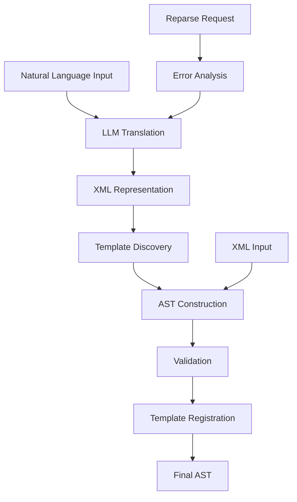

# Compiler Design Implementation

## Purpose
This document describes the design and implementation details of the Compiler component, focusing on the overall compilation process, AST construction, and template handling.

## Related Documents
- [Compiler README](../README.md)
- [Compiler Types](../spec/types.md)
- [Compiler Interfaces](../api/interfaces.md)
- [ADR 12: Function-Based Template Model](../../../system/architecture/decisions/completed/012-function-based-templates.md)

## Compilation Process

The compilation process follows these high-level steps:

1. **Input Processing**: Parse natural language input or structured XML
2. **Template Discovery**: Identify and extract template definitions
3. **AST Construction**: Build an Abstract Syntax Tree representation
4. **Validation**: Validate the AST against schema and structural rules
5. **Template Registration**: Register templates for function-based calls
6. **Output Generation**: Produce the final AST or XML representation

### Flow Diagram

## AST Construction

The AST construction process transforms XML or natural language into a structured tree representation:

1. **Parsing**: Convert XML elements to corresponding AST nodes
2. **Node Creation**: Create appropriate node types based on element attributes
3. **Tree Building**: Establish parent-child relationships between nodes
4. **Type Assignment**: Assign appropriate types to nodes based on context
5. **Reference Resolution**: Resolve references to templates and variables

The AST construction follows a recursive descent approach, processing each element and its children to build the complete tree structure.

## Template Registration

Template registration is a critical part of the function-based template model:

1. **Template Extraction**: Extract template definitions from the input
2. **Validation**: Validate template structure and parameter declarations
3. **Registration**: Register templates in a central registry
4. **Reference Checking**: Ensure all template references are valid
5. **Cycle Detection**: Detect and prevent circular template references

Templates are registered in a central registry that is accessible during evaluation to resolve function calls.

## Function Call Resolution

Function call resolution implements the function-based template model:

1. **Template Lookup**: Look up the template by name in the registry
2. **Argument Evaluation**: Evaluate arguments in the caller's environment
3. **Parameter Binding**: Bind arguments to template parameters
4. **Environment Creation**: Create a new environment for the function call
5. **Body Evaluation**: Evaluate the template body in the new environment

This approach ensures clear boundaries between caller and callee contexts, preventing implicit variable access and improving reasoning about variable scope.

## Tree Traversal Requirements

The Compiler implements specific traversal requirements for the AST:

- **Templates are registered, not traversed directly**: Templates are registered in a central registry and referenced by name during function calls.
- **Function calls trigger template lookup and execution**: When a function call node is encountered, the template is looked up in the registry and executed with the provided arguments.
- **Arguments are evaluated in caller's environment**: Function arguments are evaluated in the caller's environment before being passed to the function.

These requirements ensure proper scoping and execution semantics for the function-based template model.

## Error Handling

The Compiler implements robust error handling during the compilation process:

1. **Syntax Errors**: Errors in the input syntax are detected and reported with location information.
2. **Validation Errors**: Structural and schema validation errors are reported with detailed information.
3. **Reference Errors**: Invalid template or variable references are detected and reported.
4. **Type Errors**: Type mismatches or invalid type assignments are detected and reported.

Errors include detailed information about the error location, type, and context to facilitate debugging and correction.
