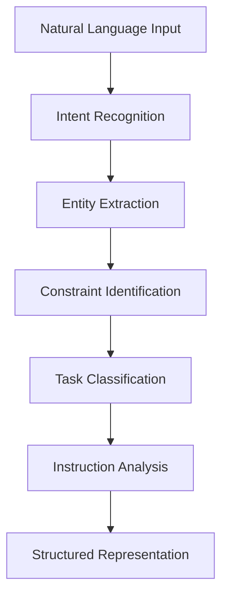
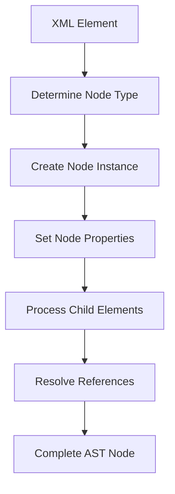

# Compiler Transformation Implementation

## Purpose
This document describes the implementation details of the transformation mechanisms in the Compiler component, focusing on natural language processing, XML generation, and AST transformation.

## Related Documents
- [Compiler README](../README.md)
- [Compiler Design](./design.md)
- [Compiler Types](../spec/types.md)

## Natural Language Processing

The Compiler uses natural language processing techniques to understand task requirements and constraints:

1. **Intent Recognition**: Identify the primary intent of the task
2. **Entity Extraction**: Extract key entities and parameters
3. **Constraint Identification**: Identify constraints and requirements
4. **Task Classification**: Classify the task type and complexity
5. **Instruction Analysis**: Analyze completeness of instructions

Natural language processing is implemented through LLM-based translation, leveraging the LLM's understanding capabilities to extract structured information from unstructured text.

### NLP Process Flow



## XML Generation

The Compiler generates XML representations from natural language through LLM-based translation:

1. **Prompt Construction**: Construct a prompt that guides the LLM to generate valid XML
2. **LLM Invocation**: Invoke the LLM with the constructed prompt
3. **Response Parsing**: Parse the LLM response to extract the XML
4. **Validation**: Validate the generated XML against the schema
5. **Error Correction**: If validation fails, attempt to correct errors

XML generation is a critical step in the compilation process, transforming unstructured natural language into a structured representation that can be further processed.

### XML Generation Example

```
Input: "Analyze the data in file.csv and generate a summary report"

Output:
<task type="sequential">
  <description>Analyze data and generate report</description>
  <steps>
    <task type="atomic">
      <description>Load and analyze data from file.csv</description>
      <file_paths>
        <path>file.csv</path>
      </file_paths>
    </task>
    <task type="atomic">
      <description>Generate summary report based on analysis</description>
    </task>
  </steps>
</task>
```

## AST Transformation

The Compiler transforms XML representations into AST nodes:

1. **Element Mapping**: Map XML elements to corresponding AST node types
2. **Attribute Extraction**: Extract attributes and assign to node properties
3. **Child Processing**: Process child elements recursively
4. **Reference Resolution**: Resolve references to templates and variables
5. **Type Assignment**: Assign appropriate types to nodes

AST transformation creates a structured tree representation that can be efficiently processed by the Evaluator.

### AST Transformation Process



## Template Discovery

The Compiler identifies and extracts template definitions from the input:

1. **Template Identification**: Identify template definitions in the input
2. **Parameter Extraction**: Extract parameter declarations
3. **Body Extraction**: Extract the template body
4. **Validation**: Validate the template structure
5. **Registration**: Register the template for later use

Template discovery is essential for the function-based template model, enabling the definition and use of reusable task components.

### Template Discovery Example

```
Input XML:
<template name="process_data" params="filepath,options">
  <task type="sequential">
    <description>Process data from {{filepath}} with {{options}}</description>
    <steps>
      <task type="atomic">
        <description>Load data from {{filepath}}</description>
      </task>
      <task type="atomic">
        <description>Apply processing with {{options}}</description>
      </task>
    </steps>
  </task>
</template>

Extracted Template:
{
  name: "process_data",
  parameters: ["filepath", "options"],
  body: {/* TaskNode representing the sequential task */},
  returns: undefined
}
```

## Error Handling

The Compiler implements robust error handling during transformation:

1. **Parsing Errors**: Handle errors in parsing natural language or XML
2. **Transformation Errors**: Handle errors in transforming between representations
3. **Reference Errors**: Handle errors in resolving references
4. **Type Errors**: Handle errors in type assignment
5. **Recovery Strategies**: Implement strategies for recovering from errors

Error handling ensures that transformation failures are properly reported and, when possible, recovered from.

### Error Recovery Strategies

- **Partial Transformation**: Continue transformation with partial results when possible
- **Default Values**: Use default values for missing or invalid attributes
- **Simplification**: Simplify complex structures that cannot be fully transformed
- **Fallback Templates**: Use fallback templates when specific templates cannot be resolved
- **Error Annotations**: Annotate the AST with error information for later handling

These strategies enable the Compiler to produce usable results even in the presence of transformation errors.
