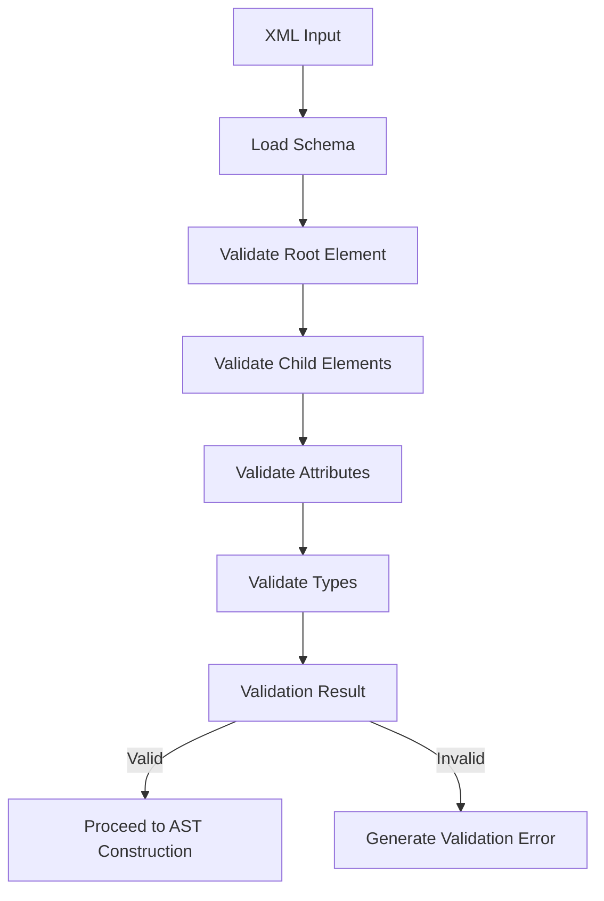

# Compiler Validation Implementation

## Purpose
This document describes the implementation details of the validation mechanisms in the Compiler component, focusing on schema validation, AST validation, and template validation.

## Related Documents
- [Compiler README](../README.md)
- [Compiler Types](../spec/types.md)
- [Contract:Tasks:TemplateSchema:1.0](../../../system/contracts/protocols.md)

## Schema Validation

The Compiler implements XML schema validation to ensure that task definitions conform to the expected structure:

1. **Schema Loading**: Load the XML schema definition from the canonical source
2. **Element Validation**: Validate each XML element against the schema
3. **Attribute Validation**: Ensure required attributes are present and have valid values
4. **Structure Validation**: Verify that element nesting follows the schema rules
5. **Type Validation**: Check that attribute values have the correct types

Schema validation is performed early in the compilation process to catch structural errors before AST construction.

### Schema Validation Process



## AST Validation

After constructing the AST, the Compiler performs additional validation to ensure semantic correctness:

1. **Node Type Validation**: Ensure each node has a valid type
2. **Parent-Child Validation**: Verify that parent-child relationships are valid
3. **Reference Validation**: Check that all references to templates and variables are valid
4. **Cycle Detection**: Detect and prevent circular references
5. **Depth Validation**: Ensure the AST does not exceed maximum depth limits

AST validation ensures that the constructed tree is semantically valid and can be executed by the Evaluator.

## Template Validation

Template validation focuses on ensuring that function templates are correctly defined and used:

1. **Parameter Validation**: Ensure parameter names are valid and unique
2. **Body Validation**: Validate the template body structure
3. **Reference Validation**: Check that all parameter references in the body are valid
4. **Return Type Validation**: Validate the optional return type if specified
5. **Usage Validation**: Ensure template usage follows the function call protocol

Template validation is critical for the function-based template model, ensuring that templates can be correctly registered and called.

### Template Validation Rules

- Template names must be unique within a compilation unit
- Parameter names must be unique within a template
- All parameters referenced in the template body must be declared
- Template bodies must be valid task nodes
- Template references must point to registered templates
- Function calls must provide the correct number of arguments
- Nested function calls must follow the same validation rules

## Function Call Validation

Function call validation ensures that function calls are correctly structured and reference valid templates:

1. **Template Existence**: Verify that the referenced template exists
2. **Argument Count**: Ensure the correct number of arguments is provided
3. **Argument Type**: Validate argument types against expected parameter types
4. **Nested Call Validation**: Recursively validate nested function calls
5. **Cycle Detection**: Prevent circular function calls

Function call validation ensures that function calls can be correctly resolved during evaluation.

## Error Generation

When validation fails, the Compiler generates detailed error information:

1. **Error Type**: Categorize the error (schema, AST, template, function call)
2. **Location**: Provide the location of the error in the source
3. **Context**: Include relevant context information
4. **Suggestion**: When possible, suggest corrections
5. **Severity**: Indicate whether the error is fatal or a warning

Error information is structured to facilitate debugging and correction, with clear indications of the error location and nature.

### Error Structure

```typescript
interface ValidationError {
  type: 'schema' | 'ast' | 'template' | 'function_call';
  message: string;
  location: {
    line: number;
    column: number;
    source: string;
  };
  context?: any;
  suggestion?: string;
  severity: 'error' | 'warning';
}
```

This structured approach to error generation ensures that validation errors are informative and actionable.
