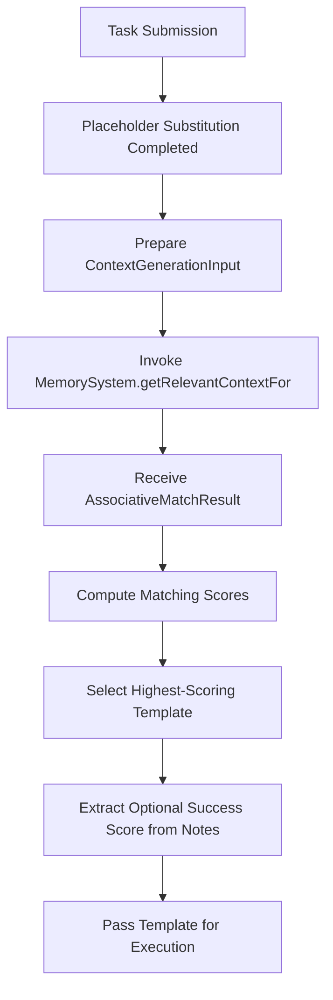

# Evaluator Component

## Overview

The **Evaluator** is the unified task-execution component of the system. It is responsible for:

1. **Controlling AST processing and execution**  
2. **Managing failure recovery** via standard task return statuses (`COMPLETE`, `CONTINUATION`, `FAILED`)
3. **Tracking resource usage** (in coordination with Handlers)
4. **Handling reparse/decomposition requests** when tasks fail (e.g. due to resource exhaustion or invalid output)

### References in Existing Documentation

- **System-Level References**  
  - *System README (`system/README.md`)* and *Architecture Overview (`system/architecture/overview.md`)* list the Evaluator as a core component, describing it as the manager for AST execution, resource tracking, and reparse/error handling.  
  - *Contracts & Interfaces (`system/contracts/interfaces.md`)* references "[Contract:Integration:EvaluatorTask:1.0]," tying the Evaluator to tasks and describing the need for an integration interface (though that interface is not yet fully elaborated).  
  - The *"Metacircular Evaluator"* concept is mentioned in `misc/textonly.tex.md`, demonstrating an evaluator that calls LLM operations as part of `apply-proc` and `eval-task`. This underscores that the Evaluator runs tasks by leveraging LLM-based primitives (for decomposition, atomic calls, or re-checking).  

- **Error Handling**  
  - The Evaluator is mentioned repeatedly (e.g., `misc/errorspec.md`, `system/architecture/patterns/errors.md`) as the component receiving error signals from tasks or sub-operations. It manages or coordinates the "control flow" when resource exhaustion or invalid outputs appear.  
  - Errors of type `RESOURCE_EXHAUSTION` or `TASK_FAILURE` can cause the Evaluator to request "reparse" or "decomposition."  

- **Implementation Plan**  
  - *Phase 2: Expanded Context Management* mentions extending environment usage so that sub-tasks may inherit or manage context. The Evaluator is implicitly involved in ensuring tasks have the right environment or partial results.  
  - *Phase 3: Task Execution Enhancements* explicitly names the Evaluator as a place to add "summary output or additional logging" for advanced debugging. The same phase also suggests new flags like `rebuild_memory` or `clear_memory` that the Evaluator would honor when building or discarding context.  

In many existing code examples (both TypeScript-like and Scheme-like), the system calls an `eval` or `apply` function that effectively belongs to the Evaluator domain. When direct execution fails, a decomposition or reparse step is triggered, also under the Evaluator's responsibility.

## 3.1 Nested Environment Model Integration

The Environment class supports nested scopes via an "outer" reference. The Evaluator creates a global environment (globalEnv) that includes built-in variables along with an instance of TaskLibrary (e.g., globalEnv.bindings["taskLibrary"] = taskLibrary). A new child environment is created for each task or function call.

```typescript
// Example Environment implementation
class Env implements Environment {
    constructor(public bindings: Record<string, any> = {}, public outer?: Environment) {}
    find(varName: string): any {
        return (varName in this.bindings)
            ? this.bindings[varName]
            : this.outer ? this.outer.find(varName) : throw new Error(`Variable ${varName} not found`);
    }
    extend(bindings: Record<string, any>): Environment {
        return new Env(bindings, this);
    }
}
```

## Nested Environment Model for Function Templates

Function calls create new environments with parameter bindings:

```typescript
// Function call evaluation
function evaluateFunctionCall(call: FunctionCallNode, env: Environment): Promise<any> {
  // 1. Lookup the template in the TaskLibrary
  const template = env.find("taskLibrary").get(call.templateName);
  
  // 2. Evaluate all arguments in the caller's environment
  const argValues = await Promise.all(
    call.arguments.map(arg => evaluateArgument(arg, env))
  );
  
  // 3. Create a new environment with parameter bindings
  const funcEnv = env.extend({});
  for (let i = 0; i < template.parameters.length; i++) {
    funcEnv.bindings[template.parameters[i]] = argValues[i];
  }
  
  // 4. Evaluate the template body in the new environment
  return evaluateTask(template.body, funcEnv);
}
```

This ensures proper variable scoping where templates can only access their explicitly declared parameters, not the caller's entire environment.

## Responsibilities and Role

1. **AST Execution Controller**  

## Context and Template Matching

Before executing tasks, the Evaluator ensures that all placeholder substitutions (e.g., `{{variable_name}}`) are completed, so that work is performed on fully resolved inputs. Associative matching tasks follow this substitution rule, operating on the final, substituted task description.

Furthermore, the Evaluator extracts an optional success score from the task result's `notes` field. This score, if present, is intended to support future adaptive matching and error-handling strategies.

For more details on context handling and the disable context option implemented for atomic tasks, see [ADR 002 - Context Management](../../system/architecture/decisions/002-context-management.md) and [ADR 005 - Context Handling](../../system/architecture/decisions/005-context-handling.md).

#### Evaluator Coordination Diagram



1. **AST Execution Controller**  
   - Orchestrates the step-by-step or operator-by-operator execution of tasks represented as an AST.
   - Calls out to the Handler for LLM-specific interactions and resource tracking (e.g. turn counts, context window checks).
   - Interacts with the Compiler when re-parsing or decomposition is required.

2. **Failure Recovery**  
   - Detects or receives error signals when tasks fail or exceed resources.  
   - Initiates "reparse" tasks or alternative decomposition approaches if the system's policies allow.  
   - Surfaces errors back to the Task System or parent contexts (e.g., "resource exhaustion," "invalid output").  

3. **Resource Usage Coordination**  
   - Not purely "owns" resource tracking (that's part of the Handler), but integrates with it. The Evaluator is aware of usage or limit errors and decides whether to attempt decomposition or fail outright.  

4. **Context and Environment Handling**  
   - In multi-step or operator-based tasks (sequential, reduce, etc.), the Evaluator ensures the proper propagation of parameters and context. Every new task or function call execution uses direct parameter passing between tasks rather than relying on environment variables. The Evaluator leverages the Memory System for associative context retrieval but does not manage file content directly.

5. **Integration with Task System**  
   - The Task System may call the Evaluator with a structured or partially structured task. The Evaluator then "executes" it by walking its representation (e.g., an AST or an XML-based operator chain).  
   - On error or partial success, the Evaluator can signal the Task System to orchestrate higher-level recovery or store partial results.  

## 3.3 FunctionCall AST Node for DSL Function Calling

The FunctionCall node is used to invoke a task functionally by looking up its definition in the TaskLibrary. When a FunctionCall is evaluated, the Evaluator:
- Uses env.find("taskLibrary") to retrieve the registry;
- Looks up the task by its funcName;
- Creates a child environment (e.g., new Env({}, env));
- Binds the parameters from task_def.metadata to the evaluated arguments;
- And finally calls taskDef.astNode.eval(newEnv) to get the result.

```typescript
// Example FunctionCall evaluation
class FunctionCallNode implements FunctionCall {
    constructor(public funcName: string, public args: ASTNode[]) {}
    async eval(env: Environment): Promise<any> {
        const taskLibrary = env.find("taskLibrary")["taskLibrary"];
        const taskDef = taskLibrary.getTask(this.funcName);
        const funcEnv = new Env({}, env);
        const parameters: string[] = taskDef.metadata?.parameters || [];
        for (let i = 0; i < parameters.length && i < this.args.length; i++) {
            funcEnv.bindings[parameters[i]] = await this.args[i].eval(env);
        }
        return await taskDef.astNode.eval(funcEnv);
    }
}
```

## FunctionCall AST Node Evaluation

The FunctionCall node represents a template invocation. When evaluated:

1. **Template Lookup**: The Evaluator retrieves the template from the TaskLibrary
2. **Argument Evaluation**: Each argument is evaluated in the caller's environment:
   - String values are checked against environment variables
   - If the string matches a variable name, the variable's value is used
   - If not, the string is treated as a literal
   - Nested AST nodes are recursively evaluated
3. **Environment Creation**: A new environment is created with bindings from parameter names to argument values
4. **Template Execution**: The template body is executed in this new environment

This process maintains clean scope boundaries, preventing unintended variable access.

### Argument Resolution Strategy

For string arguments, a two-step resolution occurs:
```typescript
function resolveArgument(arg: string, env: Environment): any {
  // First try to find it as a variable in the environment
  try {
    return env.find(arg);
  } catch (e) {
    // If not found as a variable, treat as a literal
    return arg;
  }
}
```
This allows for passing both variable references and literal values as function arguments.

## Metacircular Approach

Documentation (especially in `misc/textonly.tex.md`) sometimes refers to the system's evaluator as a "metacircular evaluator," meaning:
> The interpreter (Evaluator) uses LLM-based operations as its basic building blocks, while the LLM also uses the DSL or AST from the evaluator for self-decomposition tasks.

In practice, this means:  
- The Evaluator calls an LLM to run "atomic" tasks or to do "decomposition."  
- The LLM might generate or refine structured XML tasks that, in turn, the Evaluator must interpret again.  
- This cycle repeats until the tasks can be successfully executed without exceeding resource or output constraints.

Because of this, the Evaluator is partially "self-hosting": it leverages the same LLM to break down tasks that can't be executed directly.  

---

## Potential Future Enhancements

The existing plan outlines several optional or future features that involve the Evaluator:

1. **Advanced Debug Logging** (Phase 3 in the Implementation Plan)  
   - Collecting or storing extensive logs in `notes.debugLogs` or similar.  
   - Exposing partial steps or re-try decisions for advanced debugging.  

2. **`rebuild_memory` or `clear_memory` Flags**  
   - When tasks specify these, the Evaluator would create or discard certain environment data at the start of a sub-task.  
   - This is relevant for tasks that explicitly want a fresh context (e.g., ignoring prior steps' context).  

3. **Multi-Step or "Continuation" Protocol**  
   - The Evaluator might support tasks that require multiple interactions or "continuation steps" without losing context.  
   - This could involve storing partial states or sub-results in the environment and continuing in a new iteration.  

4. **Agent Features** (Phase 4 in some documents)  
   - The Evaluator could handle conversation-like tasks with a "REPL" approach, or coordinate multiple LLM backends.  
   - This is out of scope for the MVP, but recognized as an extension point.

---

## Known Open Questions

1. **Partial Results**  
   - Some references (e.g., "Phase 2: Expanded Context Management") mention partial-result handling if sub-tasks fail mid-operator. It is not yet finalized how the Evaluator will pass partial data up or whether to discard it.  

2. **Context Generation Errors**  
   - The error taxonomy may or may not include a dedicated "CONTEXT_GENERATION_FAILURE." Currently, the Evaluator might treat it as a generic `TASK_FAILURE` or trigger reparse.  

3. **Inheritance on Map/Reduce**  
   - It is hinted that "inherit_context" might become relevant for parallel or reduce operators. The Evaluator's role in distributing or discarding environment data for sub-tasks is still being discussed.

---

## Summary

The Evaluator coordinates the execution of tasks—represented in AST or XML-based form—by calling LLM operations, handling resource usage signals, managing sub-task context, and recovering from errors. It serves as the system's "control loop" for deciding whether tasks can be executed directly or require alternative approaches (like decomposition).  

*For further details:*  
- **System-Level Descriptions:** See `system/architecture/overview.md`  
- **Error Patterns & Recovery:** See `system/architecture/patterns/errors.md`, `misc/errorspec.md`  
- **Metacircular Evaluator Examples:** See the "Evaluator" sketches in `misc/textonly.tex.md`  
- **Future Expansions:** Refer to Implementation Plan phases in `implementation.md` (root-level or system docs).

## Dual Context Tracking

The Evaluator manages all three dimensions of the context management model:

1. **Inherited Context**: The parent task's context, controlled by `inherit_context` setting ("full", "none", or "subset").
2. **Accumulated Data**: The step-by-step outputs collected during sequential execution, controlled by `accumulate_data` setting.
3. **Fresh Context**: New context generated via associative matching, controlled by `fresh_context` setting.

These dimensions are configured through the standardized context management XML structure:
```xml
<context_management>
    <inherit_context>full|none|subset</inherit_context>
    <accumulate_data>true|false</accumulate_data>
    <accumulation_format>notes_only|full_output</accumulation_format>
    <fresh_context>enabled|disabled</fresh_context>
</context_management>
```

When contexts are needed, the Evaluator decides which dimensions to include based on these settings.

## Associative Matching Invocation

When executing a sequential task step with `<inherit_context>none</inherit_context>` but `<accumulate_data>true</accumulate_data>` and `<fresh_context>enabled</fresh_context>`, the Evaluator:
1. Calls `MemorySystem.getRelevantContextFor()` with prior steps' partial results
2. Merges the returned `AssociativeMatchResult` into the next step's environment
3. Maintains complete separation from the Handler's resource management

### Evaluator Responsibilities for Associative Matching

* **Initiation**: The Evaluator is the *sole* caller of `MemorySystem.getRelevantContextFor()`.
* **Sequential History**: It retrieves partial outputs from `SequentialHistory` (the step-by-step data structure it maintains).
* **Context Merging**: If the step is configured for accumulation, the Evaluator incorporates the match results into the upcoming step's environment.
* **Error Handling**: Any failure to retrieve context (e.g., a memory system error) is handled through the existing `TASK_FAILURE` or resource-related error flow. No new error category is introduced.
* **No Handler Involvement**: The Handler does not participate in the retrieval or assembly of this context data, beyond tracking resource usage at a high level.

This design ensures that only the Evaluator initiates associative matching, preventing confusion about which component is responsible for cross-step data retrieval. The Memory System remains a service that simply provides matches upon request.

---

---

## Sequential Task History

When evaluating sequential tasks, the Evaluator implements the Sequential Task Management pattern [Pattern:SequentialTask:2.0] as defined in the system architecture. This includes:

- Maintaining explicit task history for each sequential operation
- Preserving step outputs until task completion or failure
- Implementing resource-aware storage with potential summarization
- Including partial results in error responses for failed sequences

The Evaluator is responsible for tracking this history independent of the Handler's resource management and implementing the appropriate accumulation behavior based on the task's context_management configuration.

For the complete specification of the Sequential Task Management pattern, including output tracking, preservation policies, and resource considerations, see `system/architecture/overview.md`.
## Director-Evaluator Pattern Implementation

The Evaluator implements the Director-Evaluator pattern as defined in [Pattern:DirectorEvaluator:1.1]. This includes support for both the dynamic variant (using CONTINUATION status) and the static variant (using the director_evaluator_loop task type).

Key responsibilities of the Evaluator in this pattern:
- Recognizing continuation requests from Director tasks
- Managing context according to the specified configuration
- Coordinating script execution when required
- Passing evaluation results back to the Director

For complete implementation details, context management integration, and execution flow, refer to the canonical pattern definition in `system/architecture/patterns/director-evaluator.md`.
