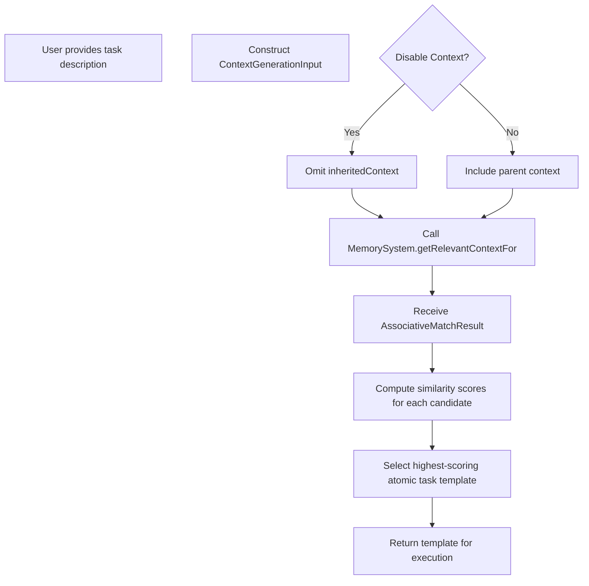

# Implementation Design

## Terminology and References

 - **Handler** and **Evaluator** definitions are standardized in [spec/types.md](../spec/types.md).
 - XML schema definitions are available in [system/contracts/protocols.md](../system/contracts/protocols.md).
 - For detailed resource tracking implementation (including turn counter and context window monitoring), see [resource-management.md](./resource-management.md).
 - For XML processing details (parsing, validation, and fallback behavior), refer to [xml-processing.md](./xml-processing.md).

## Handler Implementation
### Session Management Strategy
- One Handler per task execution
- Create new Handler instance per executeTask call
- Configure with immutable resource limits
- Set system prompt during initialization
- Clean session termination on completion
  
### Resource Tracking Implementation
- Turn counter per Handler
- Context window size monitoring
- Token usage tracking
- Resource limit enforcement
- No cross-Handler resource sharing

### Error Propagation Design
- Standard error type system
- Immediate propagation on detection
- Clean resource release
- No retry attempt handling
- Complete error context preservation

### Interactive Session Support
- Input detection capabilities
- Agent-controlled input requests
- Resource tracking during interaction
- Input timeout handling
- Cancellation support

## Template Management
### Storage Implementation
- XML file-based storage
- Disk-based persistence
- Directory organization by type
- Template versioning support
- Schema validation enforcement
  
### Validation Implementation
- Basic XML structure validation
- Schema conformance checking
- Warning generation for issues
- Template field validation
- Model availability checking
  
### Matching Algorithm Design
- Scoring based on prompt results
- Top-N candidate selection
- Separate matching for human input vs AST
- Score normalization
- Clear ordering requirements
  
### XML Processing Details
- Lenient parsing with fallback
- Warning collection
- Graceful degradation
- Partial parsing support
- Clear error locations

## Task/Template Matching

The Task System uses a heuristic, associative matching process for atomic tasks. In this approach:

- **Heuristic Matching:** User-defined associative matching tasks compare a task's free-form description against available atomic task templates. There is no fixed metric; each matching task computes a similarity score based on fixed input/output conventions.
- **Disable Context Option:** An optional "disable context" flag can be set in the task's `ContextGenerationInput` to omit inherited context entirely. This ensures that only the explicit task description and any previous outputs inform the matching process.
- **Highest-Scoring Candidate:** The system evaluates all candidates and selects the template with the highest score. Composite tasks are built by sequencing multiple atomic task templates rather than by direct template matching.

For further details on context handling and related design decisions, see [ADR 002 - Context Management](../../system/architecture/decisions/002-context-management.md) and [ADR 005 - Context Handling](../../system/architecture/decisions/005-context-handling.md).

#### Matching Call Chain

## Resource Management

The Task System enforces resource limits via a per‑Handler turn counter and context window monitoring. For the complete low‑level implementation (including code examples and configuration details), please refer to [resource-management.md](./resource-management.md).
  
### Context Window Management
- Token counting approach
- Size limit enforcement
- No optimization strategy
- Window usage monitoring
- Clear limit boundaries
  
### Limit Enforcement Strategy
- Immediate termination on violation
- Resource exhaustion error generation
- Clean session cleanup
- Resource usage reporting
- Clear violation metrics
  
### Error Detection Mechanisms
- Resource limit monitoring, progress tracking, output and XML structure validation, and input validation.

### Environment Management

#### Output Slot Management
The design now leverages last_evaluator_output as the single persistent feedback variable. The function prepareContinuationEnv(currentEnv) constructs a new environment retaining only last_evaluator_output, ensuring that all other keys are cleared on continuation.

On continuation, the evaluator clears all environment variables except for last_evaluator_output. This reset is achieved via the prepareContinuationEnv helper, which copies only last_evaluator_output from the current environment.

### Script Execution Implementation
The system now supports executing external scripts as part of a static director-evaluator workflow. When a task of type "script" is encountered, the Handler:
- Detects the "script" task type.
- Executes the specified external command (e.g. a bash script).
- Captures the command's standard output, error output, and exit code.
- Passes the script's output to the subsequent evaluator task.

During script execution, the evaluator invokes the script task, captures its outputs (stdout, stderr, and exitCode), and then wraps these into an EvaluationResult. This result is stored in last_evaluator_output, which is later used by the Director upon resuming the sequence.

This design ensures that the director's output flows seamlessly through the script execution step before final evaluation.

## Integration Points
### Memory System Interaction
- Uses Anthropic's computer use tools for file operations.
- Read-only access.
- No state maintenance.
- Clear context boundaries.
- Standard memory structure.
  
### Compiler Integration
- Task parsing services
- XML validation
- Schema conformance
- Error surfacing
- Validation feedback
  
### Evaluator Support
- Error surfacing
- Reparse template support
- No retry management
- State preservation
- Recovery guidance
  
### LLM Session Management
- Handler encapsulation
- Resource tracking
- Model selection support
- Clean termination
- Session isolation
