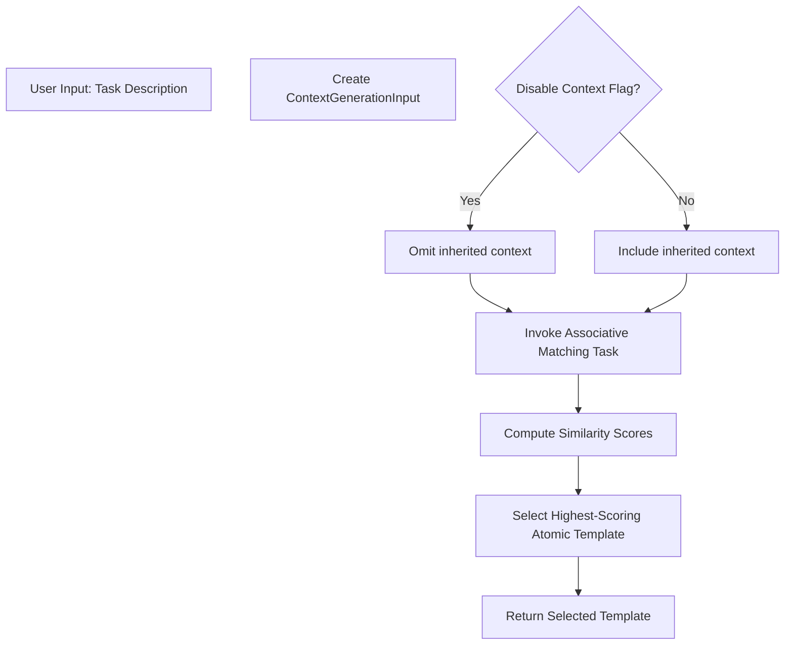

# Task System Behaviors

This document describes the runtime behaviors of the Task System.

## Overview

The Task System is responsible for managing LLM task execution, including:
 - Template matching and management,
 - Lifecycle handling for Handlers,
 - XML processing with graceful degradation, and
 - Error detection and recovery.

## Key Behavior Highlights

1. **Template Management:**  
   - Task templates are stored and validated against the XML schema defined in [Contract:Tasks:TemplateSchema:1.0].  
   - The system matches both natural language inputs and AST nodes to candidate templates (up to 5 candidates), using numeric scoring.

2. **Handler Lifecycle:**  
   - A new Handler is created for each task execution with an immutable configuration.
   - The Handler enforces resource limits (turn counts, context window limits) as described in [Pattern:ResourceManagement:1.0].

3. **XML Processing:**  
   - Basic structural validation is performed, with warnings generated for non‑critical issues.
   - In cases of partial XML parsing failure, the original content is preserved and error details are included in the task notes.

4. **Error Handling:**  
   - Errors such as RESOURCE_EXHAUSTION and TASK_FAILURE are surfaced according to the rules defined in [Pattern:Error:1.0].
   - The Evaluator delegates error recovery (e.g., reparse tasks) and includes partial outputs when available.

## See Also

 - [Task System Requirements](requirements.md)
 - [Task System Interfaces](interfaces.md)
 - System-level error handling: [Pattern:Error:1.0]

### Interactive Sessions
- Handler monitors LLM responses for input requests
- No special task type or mode required
- Agent controls when input is needed
- Input Flow:
  ```
  LLM Output -> Handler Detects Request -> onRequestInput Called -> 
  User Input Received -> Continue Conversation
  ```
- Same resource tracking as normal conversation
- Input interactions count against turn limits
- Context window includes all interaction history

### XML Processing
- Basic structural validation only
- Warning generation for validation issues
- Lenient output parsing with fallback
- Graceful handling of partially valid XML
- Support for manual XML task flag

## Task Execution

### Standard Task Execution
- Process tasks using appropriate templates
- Return both output and notes sections in TaskResult structure
- Surface errors for task failure or resource exhaustion
- Support specialized execution paths for reparsing and memory tasks
- Implement lenient XML output parsing with fallback to single string
- Generate warnings for malformed XML without blocking execution
- Include 'data usage' section in task notes as specified by system prompt

### Task Template Matching

#### Human Input Matching
- Input: Natural language text + initial environment
- Process:
  - Uses matching specialized task from library
  - Considers provided files in environment
  - No access to previous executions/history
- Output: 
  - Up to 5 highest-scoring templates
  - Each match includes numeric score and template
  - Templates ordered by descending score

#### AST Node Matching
- Input: Single AST node
- Process:
  - Uses node-specific matching task
  - Only considers node-level context
  - No traversal of parent/child nodes
- Output:
  - Up to 5 highest-scoring templates
  - Each match includes numeric score and template
  - Templates ordered by descending score

**Additional Matching Details:**
- **Heuristic Matching:** The matching is performed heuristically using user-defined associative matching tasks. These tasks compute similarity scores based on fixed input/output conventions without a fixed system-wide metric.
- **Disable Context Flag:** Atomic tasks have an optional "disable context" flag available in their ContextGenerationInput. When enabled, inherited context is omitted from the matching process.
- **Optional Success Score:** Task execution results may include an optional success score in the `notes` field. This score is used for future adaptive template matching (although adaptive behavior is not part of the MVP).

#### Matching Behavior Summary



### Specialized Task Types

#### Reparse Tasks
- Triggered by:
  - Resource exhaustion errors
  - Invalid output errors
  - Progress failure errors
- Uses specialized templates from separate directory
- Returns new task structure or alternative approach

#### Memory Tasks
- Direct memory system access
- Uses associative matching templates
- Returns relevant context selections

## Memory System Integration

### File Operations
- Uses Anthropic's computer use tools:
  * computer_20241022
  * text_editor_20241022
  * bash_20241022
- No direct file operation interface
- Managed through Anthropic's tool use system
- See Anthropic documentation for details

### Context Management
- Context accessed via async getContext/updateContext
- File metadata accessed via GlobalIndex
- Existing context preserved during task execution
- Structure/parsing handled by associative memory tasks

### State Management
- No complex file metadata tracking
- Minimal state maintenance between tasks
- Clear task execution boundaries
- Simple file modification tracking

## File Operations
- Uses Anthropic's computer use tools:
  * computer_20241022
  * text_editor_20241022
  * bash_20241022
- No direct file operation interface
- Managed through Anthropic's tool use system
- See Anthropic documentation for details

## Context Management Delegation

The Task System delegates **all context management** to the Evaluator. In other words:
1. The Task System's role is primarily to define task structure (sequential, map, reduce, etc.) and signal the Evaluator to execute steps.
2. The Evaluator decides how and when to call `MemorySystem.getRelevantContextFor()`.
3. The Handler remains focused on resource tracking (turns, tokens).
4. No direct context accumulation logic occurs in the Task System itself.

## Error Handling

### Error Detection and Response

#### Resource Exhaustion
- Handler detects limit violations
- Immediate task termination
- Surfaces through standard error type
- Resource accounting completion
- Clean Handler termination
- No retry attempts

#### Invalid Output
- Structural validation failure
- Format validation errors
- No semantic validation
- Preserves partial outputs when useful
- Returns both output and notes sections
- May trigger reparse task

#### Progress Failure
- Handler detects stalled execution
- Task-specific progress indicators
- No internal progress tracking
- May trigger alternative approach
- State preserved in error response
- No automatic retry

#### XML Validation
- Immediate failure on invalid structure
- No warning collection
- Clear error messages
- Location information when available
- May trigger reparse if not disabled

### Error Response

#### Error Surfacing
- Uses standard error type system (see types.md)
- Includes relevant task notes
- Preserves partial outputs when useful
- Includes resource metrics where applicable
- Clear error messages and locations

#### Handler Cleanup
- Clean termination of LLM session
- Resource accounting completion
- No state preservation
- Context window cleanup
- Turn counter finalization

#### Recovery Delegation
- No retry attempts
- Delegates to evaluator
- Provides complete error context
- Includes notes for recovery guidance
