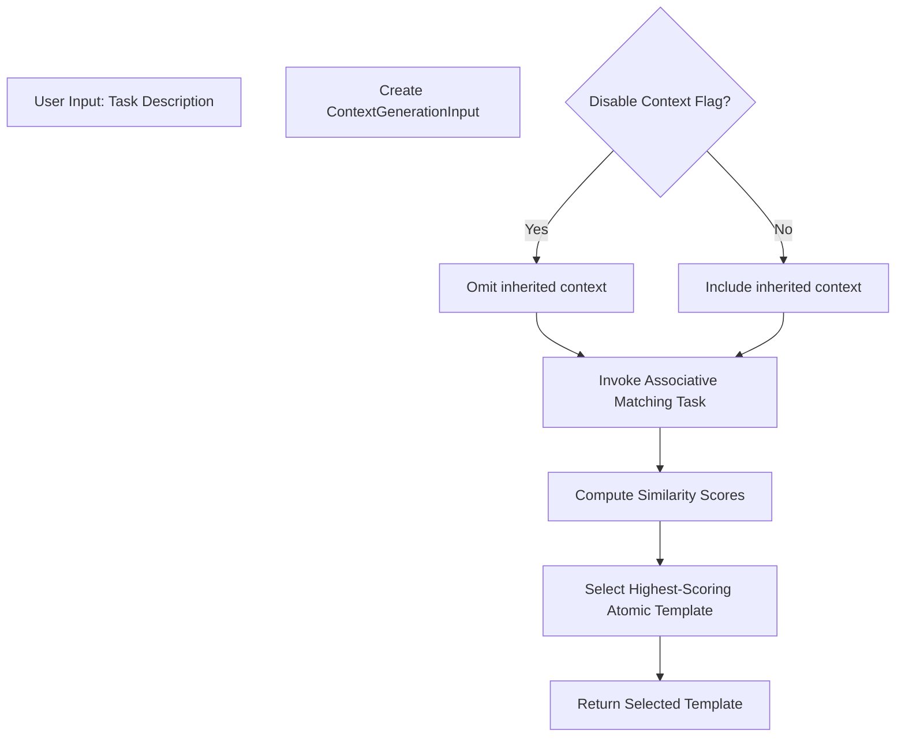

# Task System Behaviors

This document describes the runtime behaviors of the Task System.

## Overview

The Task System is responsible for managing LLM task execution, including:
 - Template matching and management,
 - Lifecycle handling for Handlers,
 - XML processing with graceful degradation, and
 - Error detection and recovery.

## Key Behavior Highlights

1. **Template Management:**  
   - Task templates are stored and validated against the XML schema defined in [Contract:Tasks:TemplateSchema:1.0].  
   - The system matches both natural language inputs and AST nodes to candidate templates (up to 5 candidates), using numeric scoring.

2. **Handler Lifecycle:**  
   - A new Handler is created for each task execution with an immutable configuration.
   - The Handler enforces resource limits (turn counts, context window limits) as described in [Pattern:ResourceManagement:1.0].

3. **XML Processing:**  
   - Basic structural validation is performed, with warnings generated for non‑critical issues.
   - In cases of partial XML parsing failure, the original content is preserved and error details are included in the task notes.

4. **Error Handling:**  
   - Errors such as RESOURCE_EXHAUSTION and TASK_FAILURE are surfaced according to the rules defined in [Pattern:Error:1.0].
   - The Evaluator delegates error recovery (e.g., reparse tasks) and includes partial outputs when available.

## See Also

 - [Task System Requirements](requirements.md)
 - [Task System Interfaces](interfaces.md)
 - System-level error handling: [Pattern:Error:1.0]

### Interactive Sessions
- Handler monitors LLM responses for input requests
- No special task type or mode required
- Agent controls when input is needed
- Input Flow:
  ```
  LLM Output -> Handler Detects Request -> onRequestInput Called -> 
  User Input Received -> Continue Conversation
  ```
- Same resource tracking as normal conversation
- Input interactions count against turn limits
- Context window includes all interaction history

### XML Processing
- Basic structural validation only
- Warning generation for validation issues
- Lenient output parsing with fallback
- Graceful handling of partially valid XML
- Support for manual XML task flag

## Task Execution

### Standard Task Execution
- Process tasks using appropriate templates
- Return both output and notes sections in TaskResult structure
- Surface errors for task failure or resource exhaustion
- Support specialized execution paths for reparsing and memory tasks
- Implement lenient XML output parsing with fallback to single string
- Generate warnings for malformed XML without blocking execution
- Include 'data usage' section in task notes as specified by system prompt

### Output Format Handling
- Format declaration via `<output_format>` element with required `type` attribute
- Supported format types:
  * "json" - Structured JSON data
  * "text" - Plain text (default)
- Optional `schema` attribute for type validation:
  * "object" - JSON object
  * "array" or "[]" - JSON array
  * "string[]" - Array of strings
  * "number" - Numeric value
  * "boolean" - Boolean value
- Automatic JSON detection:
  * Attempts to parse content as JSON when type="json"
  * Adds parsed content to TaskResult as parsedContent property
  * Falls back to original string content if parsing fails
- Type validation process:
  * Validates parsed content against schema attribute
  * Generates error if type mismatch occurs
  * Preserves original content in error details
- Template return type validation:
  * Function templates can specify return types via returns attribute
  * Return types are validated against actual output
  * Type mismatches generate validation errors

Example error structure for output_format_failure:
```typescript
{
  type: 'TASK_FAILURE',
  reason: 'output_format_failure',
  message: 'Expected output of type "array" but got "object"',
  details: {
    expectedType: "array",
    actualType: "object",
    partialOutput: "..." // The original output
  }
}
```

### Task Template Matching

#### Human Input Matching
- Input: Natural language text + initial environment
- Process:
  - Uses matching specialized task from library
  - Considers provided files in environment
  - No access to previous executions/history
- Output: 
  - Up to 5 highest-scoring templates
  - Each match includes numeric score and template
  - Templates ordered by descending score

#### AST Node Matching
- Input: Single AST node
- Process:
  - Uses node-specific matching task
  - Only considers node-level context
  - No traversal of parent/child nodes
- Output:
  - Up to 5 highest-scoring templates
  - Each match includes numeric score and template
  - Templates ordered by descending score

**Additional Matching Details:**
- **Heuristic Matching:** The matching is performed heuristically using user-defined associative matching tasks. These tasks compute similarity scores based on fixed input/output conventions without a fixed system-wide metric.
- **Disable Context Flag:** Atomic tasks have an optional "disable context" flag available in their ContextGenerationInput. When enabled, inherited context is omitted from the matching process.
- **Optional Success Score:** Task execution results may include an optional success score in the `notes` field. This score is used for future adaptive template matching (although adaptive behavior is not part of the MVP).

#### Matching Behavior Summary


```mermaid
flowchart TD
    A[User Input: Task Description]
    B[Create ContextGenerationInput]
    C{Disable Context Flag?}
    C -- Yes --> D[Omit inherited context]
    C -- No --> E[Include inherited context]
    D & E --> F[Invoke Associative Matching Task]
    F --> G[Compute Similarity Scores]
    G --> H[Select Highest-Scoring Atomic Template]
    H --> I[Return Selected Template]
```

### Specialized Task Types

#### Reparse Tasks
- Triggered by:
  - Resource exhaustion errors
  - Invalid output errors
  - Progress failure errors
- Uses specialized templates from separate directory
- Returns new task structure or alternative approach

#### Memory Tasks
- Direct memory system access
- Uses associative matching templates
- Returns relevant context selections

## Memory System Integration

### File Operations
- **Memory System**: Manages ONLY metadata (file paths and descriptive strings)
- **Handler**: Performs ALL file I/O operations (reading, writing, deletion)
- For Anthropic models: Handler configures and uses Anthropic's computer use tools
  * computer_20250124 (or 20241022)
  * text_editor_20250124 (or 20241022)
  * bash_20250124 (or 20241022)
- All file content access is always handled by the Handler, never the Memory System

### Context Management
- Context accessed via async getRelevantContextFor
- File metadata accessed via GlobalIndex
- Existing context preserved during task execution
- Structure/parsing handled by associative memory tasks
- Context clearing and regeneration handled through context_management settings
- Three-dimensional model (inherit_context, accumulate_data, fresh_context) provides complete control
- No additional flags or mechanisms needed for context operations

#### Context Operation Patterns

1. **Context Clearing**: Achieved by setting `inherit_context="none"` and `fresh_context="enabled"`
2. **Context Regeneration**: Achieved through `fresh_context="enabled"` with appropriate inheritance settings
3. **Complete Preservation**: Achieved with `inherit_context="full"`, `accumulate_data="true"`, and `fresh_context="disabled"`

### State Management
- No complex file metadata tracking
- Minimal state maintenance between tasks
- Clear task execution boundaries
- Simple file modification tracking

## Delegation Mechanisms

## Tool Interface
The LLM interacts with a unified tool system that presents consistent patterns regardless of implementation mechanism:

```typescript
// All tools appear similar to the LLM
tools.readFile("path/to/file");  // Direct implementation
tools.analyzeData({ data: content });  // Subtask implementation
```

### Direct Tool Implementation
- Handled by Handler component
- Deterministic with fixed APIs
- No continuation mechanism
- Used for file operations, APIs, script execution
- Examples: file access, bash commands, computer tools
- Direct execution without complex context management
- Resource tracking handled by Handler

### Subtask Tool Implementation
- LLM-to-LLM interactions
- Use CONTINUATION status with SubtaskRequest
- Full context management via Memory System
- Support complex reasoning and creative tasks
- Follow ADR 14 context management model
- Depth tracking to prevent infinite recursion
- Template selection via associative matching

See [Pattern:ToolInterface:1.0] for selection criteria and implementation details.

## File Operations

### Clear Responsibility Boundaries
- **Memory System**: Manages ONLY metadata (file paths and descriptive strings)
- **Handler**: Performs ALL file I/O operations (reading, writing, deletion)

### Implementation Details
- For Anthropic models: Handler configures and uses Anthropic's computer use tools
  * computer_20250124 (or 20241022)
  * text_editor_20250124 (or 20241022)
  * bash_20250124 (or 20241022)
- For other models: Handler uses appropriate alternative mechanisms
- All file content access is always handled by the Handler, never the Memory System
- The Memory System provides only file paths that may be relevant (via associative matching)
- Context Management System decides which files to read based on policy

## Subtask Spawning Behavior

The Task System implements a standardized approach to subtask spawning:

### Request Processing

1. **Validation and Preparation**
   - Validates the SubtaskRequest structure for required fields
   - Checks nesting depth against maximum allowed (default: 5)
   - Performs cycle detection to prevent recursive spawning
   - Prepares context according to context management settings

2. **Template Selection and Execution**
   - Uses the description and template_hints for associative matching
   - Selects the highest-scoring template that matches the request
   - Creates a new execution environment with direct parameter passing
   - Executes the subtask with appropriate resource tracking

3. **Result Handling**
   - Passes the complete TaskResult back to the parent task
   - Preserves partial results if the subtask fails
   - Maintains resource tracking across the subtask chain
   - Ensures proper cleanup of resources after completion

### Context Management Defaults

Subtasks have specific default context management settings:

| Setting | Default Value | Description |
|---------|---------------|-------------|
| inherit_context | subset | Inherits only relevant context from parent |
| accumulate_data | false | Does not accumulate previous step outputs |
| accumulation_format | notes_only | Stores only summary information |
| fresh_context | enabled | Generates new context via associative matching |

These defaults can be overridden through explicit configuration in the SubtaskRequest.

### Error Handling

When a subtask fails, a standardized error structure is generated:

```typescript
{
  type: 'TASK_FAILURE',
  reason: 'subtask_failure',
  message: 'Subtask execution failed',
  details: {
    subtaskRequest: {
      type: 'atomic',
      description: 'Process data',
      inputs: { /* original inputs */ }
    },
    subtaskError: {
      type: 'TASK_FAILURE',
      reason: 'execution_halted',
      message: 'Failed to process data'
    },
    nestingDepth: 2,
    partialOutput: "Partial processing results"
  }
}
```

This structure preserves the complete error context, allowing the parent task to implement recovery strategies if needed.

## Context Management Delegation

The Task System implements a hybrid configuration approach with operator-specific defaults and explicit overrides:

| Operator Type | inherit_context | accumulate_data | accumulation_format | fresh_context |
|---------------|-----------------|-----------------|---------------------|---------------|
| atomic        | full            | false           | notes_only          | enabled       |
| sequential    | full            | true            | notes_only          | enabled       |
| reduce        | none            | true            | notes_only          | enabled       |
| script        | full            | false           | notes_only          | disabled      |
| director_evaluator_loop | none  | true            | notes_only          | enabled       |

These defaults apply when no explicit context_management block is provided. When present, the explicit settings override the defaults:

```xml
<context_management>
    <inherit_context>full|none|subset</inherit_context>
    <accumulate_data>true|false</accumulate_data>
    <accumulation_format>notes_only|full_output</accumulation_format>
    <fresh_context>enabled|disabled</fresh_context>
</context_management>
```

The Task System delegates **all context management execution** to the Evaluator according to the final merged configuration. In other words:

1. The Task System's role is to:
   - Define task structure (sequential, map, reduce, etc.)
   - Process context management configuration (defaults + overrides)
   - Signal the Evaluator to execute steps with the final configuration

2. The Evaluator manages all three dimensions of context:
   - **inherit_context**: Controls parent context inheritance ("full", "none", or "subset").
   - **accumulate_data**: Controls accumulation of previous step outputs (true/false).
   - **accumulation_format**: Specifies storage format for accumulated data ("notes_only" or "full_output").
   - **fresh_context**: Controls whether new context is generated via associative matching ("enabled" or "disabled").

3. The Evaluator decides how and when to call `MemorySystem.getRelevantContextFor()` based on these settings.
4. The Handler remains focused on resource tracking (turns, tokens).
5. No direct context accumulation logic occurs in the Task System itself.

## Error Handling

### Error Detection and Response

#### Resource Exhaustion
- Handler detects limit violations
- Immediate task termination
- Surfaces through standard error type
- Resource accounting completion
- Clean Handler termination
- No retry attempts

#### Invalid Output
- Structural validation failure
- Format validation errors
- No semantic validation
- Preserves partial outputs when useful
- Returns both output and notes sections
- May trigger reparse task

#### Progress Failure
- Handler detects stalled execution
- Task-specific progress indicators
- No internal progress tracking
- May trigger alternative approach
- State preserved in error response
- No automatic retry

#### XML Validation
- Immediate failure on invalid structure
- No warning collection
- Clear error messages
- Location information when available
- May trigger reparse if not disabled

#### Partial Results Preservation

The system preserves partial results for different task types:

1. **Atomic Tasks**
   - Stores partial content in `notes.partialOutput`
   - Preserves as much of the generated output as possible
   - No structure guarantees for partial content

2. **Sequential Tasks**
   - Stores step-by-step outputs in `details.partialResults`
   - Includes metadata such as `failedStep` and `totalSteps`
   - Each step result includes `stepIndex`, `output`, and optional `notes`

3. **Reduce Tasks**
   - Stores processed input results in `details.partialResults`
   - Includes the current accumulator state in `details.currentAccumulator`
   - Tracks processed inputs in `details.processedInputs`
   - Records the failed input index in `details.failedInputIndex`

#### Format Control

The `accumulation_format` setting in the task's `context_management` block controls how much data is preserved:

```xml
<context_management>
    <inherit_context>full</inherit_context>
    <accumulate_data>true</accumulate_data>
    <accumulation_format>notes_only|full_output</accumulation_format>
    <fresh_context>enabled</fresh_context>
</context_management>
```

- `notes_only`: Only the notes field is preserved (default for memory efficiency)
- `full_output`: Both content and notes fields are preserved (with size limits)

#### Size Management

To prevent memory issues with partial results:
- Individual outputs are kept reasonably sized
- When accumulated data becomes too large, older results may be summarized or truncated
- The system indicates when truncation has occurred in the error details
- A maximum size cap applies regardless of settings

### Error Response

#### Error Surfacing
- Uses standard error type system (see types.md)
- Includes relevant task notes
- Preserves partial outputs when useful
- Includes resource metrics where applicable
- Clear error messages and locations

#### Handler Cleanup
- Clean termination of LLM session
- Resource accounting completion
- No state preservation
- Context window cleanup
- Turn counter finalization

#### Recovery Delegation
- No retry attempts
- Delegates to evaluator
- Provides complete error context
- Includes notes for recovery guidance
