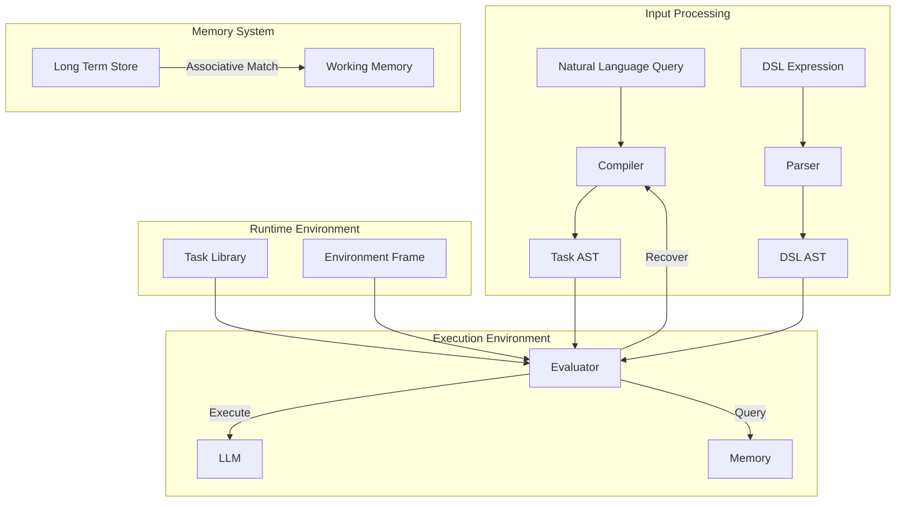

# Intelligent Task Execution System

## Overview

This system enables controlled execution of complex tasks through LLM-based task decomposition and structured execution. It treats natural language interaction as a form of code execution, using a DSL (domain-specific language) to represent task decomposition and manage execution flow.

### Key Components



## Core Architecture

### 1. DSL Interpretation
The system provides a DSL for expressing task composition and control flow:

```scheme
; Example DSL expression
(define (process-data data-source)
  (sequential
    (task "load-data" data-source)
    (reduce
      (lambda (chunk acc)
        (task "analyze-chunk" chunk acc))
      initial-value
      chunks)))
```

Key aspects of DSL interpretation:
- Lisp-like syntax for composable expressions
- First-class functions and task definitions
- Environment-based lexical scoping
- Dynamic task composition

The DSL interpreter follows a classic eval/apply model:
```typescript
interface Interpreter {
    eval(expr: Expression, env: Environment): Promise<any>;
    apply(proc: Procedure, args: any[], env: Environment): Promise<any>;
}
```

### 2. Task System
- Manages template matching and execution
- Handles XML task definitions with graceful degradation
- Enforces resource limits through Handlers
- Provides error detection and propagation

### 3. Evaluator
- Controls AST processing and execution
- Manages failure recovery through task decomposition
- Tracks resource usage with Handlers
- Handles reparse/decomposition requests
- Maintains context across task boundaries

### 4. Memory System
- Maintains global file metadata index
- Provides associative matching for context retrieval
- Delegates file operations to Handler tools
- Manages task execution context

### 5. Task Expression Framework
Supports multiple operator types:
- **Sequential**: Ordered execution with context inheritance
- **Reduce**: Result aggregation with accumulation
- **Map**: Parallel task processing
- **Atomic**: Direct LLM execution

## Key Patterns

### 1. Director-Evaluator Pattern
```xml
<task type="sequential">
    <description>Static Director-Evaluator Pipeline</description>
    <context_management>
        <inherit_context>none</inherit_context>
        <accumulate_data>true</accumulate_data>
        <accumulation_format>notes_only</accumulation_format>
    </context_management>
    <steps>
        <task>
            <description>Generate Initial Output</description>
        </task>
        <task type="script">
            <description>Run Target Script</description>
        </task>
        <task>
            <description>Evaluate Script Output</description>
        </task>
    </steps>
</task>
```

### 2. Context Management
- Explicit control through `context_management` blocks
- Three inheritance modes: full, none, subset
- Support for data accumulation across steps
- Clean separation between inheritance and accumulation

### 3. Resource Management
- Handler-based resource isolation
- Per-task resource tracking
- Clear ownership boundaries
- Explicit cleanup procedures

### 4. Error Handling
Two primary error types:
- **Resource Exhaustion**: Signals when system limits are exceeded
- **Task Failure**: Indicates unrecoverable execution failures

## Integration Patterns

### 1. Environment Model
```typescript
interface Environment {
    // Lexical scope for variable bindings
    bindings: Map<string, any>
    
    // Working memory for task execution
    context: Map<string, any>
    
    // Parent environment reference
    outer: Environment | null
    
    // Create child environment with new bindings
    extend(bindings: Map<string, any>): Environment
}
```

### 2. Memory Integration
```typescript
interface MemorySystem {
    // Find relevant context for current task
    getRelevantContextFor(input: ContextQuery): Promise<Context>
    
    // Access global metadata index
    getGlobalIndex(): Promise<GlobalIndex>
}
```

### 3. Script Execution
- Support for external command execution
- Capture of stdout, stderr, and exit codes
- Integration with evaluation workflows
- Clean error propagation

## Resource Constraints

### 1. Execution Limits
- Fixed context window size
- Limited turn counts
- Synchronous operation only
- One Handler per task execution

### 2. Memory System
- Read-only file metadata access
- No direct file content storage
- Context updates through extension only
- Clear cleanup protocols

## Development Guidelines

### 1. Task Templates
- Must conform to XML schema
- Support both LLM-generated and manual XML
- Include clear input/output contracts
- Specify context management requirements

### 2. Error Recovery
- Implement proper resource cleanup
- Surface errors with complete context
- Support task decomposition
- Maintain execution history

### 3. Context Management
- Use explicit context inheritance
- Implement clean data accumulation
- Follow resource cleanup protocols
- Maintain context boundaries

## Usage Example

```typescript
// Initialize system components
const taskSystem = new TaskSystem({
    maxTurns: 10,
    maxContextWindowFraction: 0.8,
    systemPrompt: "System-level context"
});

const memorySystem = new MemorySystem();

// Execute a task
const result = await taskSystem.executeTask(
    "Process and analyze experimental data",
    memorySystem
);

// Check results and handle any errors
if (result.status === "FAILED") {
    console.error("Task failed:", result.error);
    // Implement recovery logic
}
```

## Future Directions

### 1. Planned Enhancements
- Advanced context optimization
- Parallel execution support
- Enhanced error recovery
- Dynamic resource management

### 2. Potential Extensions
- Multi-LLM support
- Persistent context storage
- Interactive sessions
- Enhanced debugging tools

## References

1. **Core Documentation**
   - Architecture Decisions (ADRs)
   - Pattern Specifications
   - Component Interfaces

2. **Component Documentation**
   - Task System
   - Evaluator
   - Memory System
   - Handler Interface

For detailed implementation specifications and patterns, refer to the component-level documentation.
