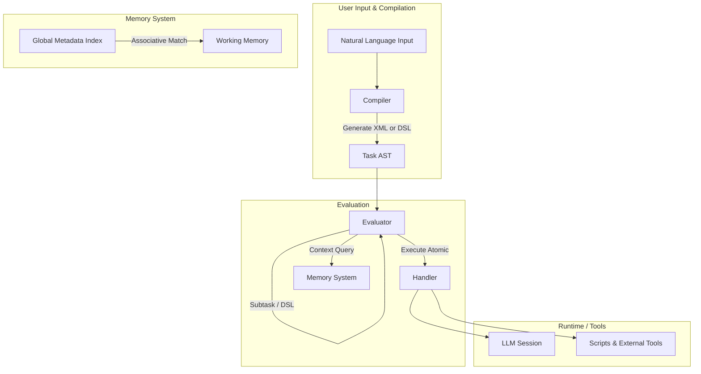

# LLM interpreter system-level description

This system proposes a programming environment for LLMs.



## Table of Contents
- [Key Capabilities](#key-capabilities)
- [Core Concepts & DSL Approach](#core-concepts--dsl-approach)
- [Architecture Overview](#architecture-overview)
- [Patterns & Execution Model](#patterns--execution-model)
- [Resource & Error Handling](#resource--error-handling)
- [Usage Workflow](#usage-workflow)
- [Development & Extension](#development--extension)
- [Examples](#examples)
- [References & Documentation Map](#references--documentation-map)

## Key Capabilities

- **Task Decomposition**
  - Convert a complex prompt into smaller, structured subtasks or DSL "functions."
- **DSL & XML Representation**
  - Represent tasks with a domain-specific language (Scheme-like or XML-based) that is easily parsed, versioned, and extended.
- **Resource-Aware Execution**
  - Limit turns and context windows to avoid runaway costs, with warnings at 80% usage.
- **Context Management**
  - Inherit, accumulate, or fetch fresh context using a three-dimensional model (inherit_context, accumulate_data, fresh_context).
- **Director-Evaluator Pattern**
  - Iterative refinement pattern that uses a "director" for output generation and an "evaluator" for feedback, optionally coupled with script execution steps.
- **Subtask Spawning**
  - Dynamically create subtasks if a parent task decides it needs to break the problem down further.
- **Error Taxonomy & Partial Results**
  - Structured error types (resource exhaustion, invalid output, subtask failure) with optional partial outputs for robust debugging and recovery.
- **Modular Components**
  - Compiler for translation, Evaluator for step execution, Memory System for metadata, Handler for LLM calls and script bridging.

## Core Concepts & DSL Approach

### Tasks as Code
A user's request can be viewed as a "program," with subtasks akin to function calls. The system can compile these instructions into either XML operators or a Scheme-like DSL:

```scheme
(define (process-data data-source)
  (sequential
    (task "load-data" data-source)
    (reduce 
      (lambda (chunk acc)
        (task "analyze-chunk" chunk acc))
      initial-value
      chunks)))
```

### DSL vs. XML

- **XML** is convenient for interoperability, partial validation, and structured storage.
- **DSL** is more expressive and compositional, letting you nest or map tasks in functional style.
- Both representations ultimately feed into the Evaluator, which orchestrates subtask calls.

### Lexical Environment and context management
Each DSL expression or XML subtask runs in an environment that may inherit context window data from its parent, in addition to lexically bound variables. 

## Architecture Overview

| Component | Responsibility | Docs |
|-----------|----------------|------|
| Compiler | Translate natural language or user input into a DSL/AST or XML. | [Compiler README](../components/compiler/README.md) |
| Evaluator | Walk the AST, manage subtask calls, handle resource usage. | [Evaluator README](../components/evaluator/README.md) |
| Task System | Provide operators, templates, and pattern frameworks. | [TaskSystem README](../components/task-system/README.md) |
| Memory System | Manage file metadata & associative context retrieval. | [Memory README](../components/memory/README.md) |
| Handler | Interact with the LLM, track turns/tokens, run scripts. | Handler Interface Docs |

### Flow
1. User Input → [Compiler] → AST (XML or DSL)
2. Evaluator interprets AST, possibly fetching context from [Memory].
3. Handler enforces resource limits (turn count, context window) and calls the LLM or external scripts.
4. Subtasks spawn recursively if the Evaluator returns "CONTINUATION" with a subtask request.

## Patterns & Execution Model

### 1. Director-Evaluator Pattern
A powerful approach for iterative refinement:

1. Director produces an initial output.
2. Evaluator checks correctness, possibly runs a validation script.
3. If improvements are needed, the Director is called again with the evaluator's feedback.

This can be done with either a static (predefined) or dynamic (continuation-based) approach.

### 2. Context Management (Three-Dimensional)
- **inherit_context**: "full," "none," or "subset" from the parent.
- **accumulate_data**: Collect partial outputs from prior steps.
- **fresh_context**: Whether to fetch new context from Memory.

### 3. Subtask Spawning
The system can create new subtasks if a task returns `status: "CONTINUATION"` along with a subtask request in notes.

### 4. DSL Environment Model
- Lexical scoping for variables
- Evaluate or apply steps akin to a "metacircular interpreter"
- Potential for dynamic decomposition if tasks fail or are incomplete

## Resource & Error Handling

### Resource Exhaustion
- Handler raises `RESOURCE_EXHAUSTION` if turn count or context window is exceeded.
- The Evaluator can attempt decomposition or surface an error to the parent.

### Invalid Output & Parsing
- If an atomic task yields invalid XML or fails DSL constraints, we capture partial output in notes and either reparse or fail.

### Partial Results
- Operators like "sequential" can preserve prior step outputs even if a later step fails.
- The final error message includes partial outputs if the partial-results policy is enabled.

### Context-Generation Failures
- Typically signaled as a `TASK_FAILURE` with reason codes like "context_retrieval_failure" or "context_parsing_failure."
- The system can attempt fallback or re-try with simpler context if the policy allows.

## Usage Workflow

Below is a typical usage sequence:

1. User submits a high-level command or request.
2. Compiler produces an AST in XML or DSL form.
3. Evaluator loads the AST, checks resource availability, and sets up a Handler.
4. Evaluator executes tasks step by step. For each atomic step:
   - The Handler calls the LLM or runs a script, tracks tokens/turns, returns output.
   - If any step or subtask triggers re-parse or subtask spawning, the Evaluator orchestrates it.
5. Once done, the final TaskResult includes the content, status, and notes fields (which might hold partial results, warnings, or success scores).

## Development & Extension

### Defining New DSL Operators
- Add a new operator for your custom logic (e.g. "map," "filter," "director_evaluator_loop").
- Specify how it inherits context and whether it accumulates partial outputs.

### Authoring Task Templates in XML
- Use `<task type="atomic" ...>` or `<task type="sequential" ...>` with a `<context_management>` block.
- Provide `<inputs>` for data binding and an `<expected_output>` if relevant.

### Error Handling & Recovery
- Consider how partial results help your tasks recover from local failures.
- Possibly define a re-parse template to handle resource exhaustion.

### Resource Configuration
- Per-task or system-wide, set maxTurns, maxContextWindowFraction, etc. in the Handler config.
- Handler automatically enforces these limits.

## Examples

### 1. DSL Example (Scheme-style)
```scheme
(define (director-eval-pipeline initial-data)
  (sequential
    (task "director" initial-data)
    (task "script-execution" (lambda (dirOutput)
       (bash-run "analysis.sh" dirOutput)))
    (task "evaluator" "Evaluate script output" )))
```

### 2. XML Example
```xml
<task type="sequential">
  <description>Static Director-Evaluator Pipeline</description>
  <context_management>
    <inherit_context>none</inherit_context>
    <accumulate_data>true</accumulate_data>
    <accumulation_format>notes_only</accumulation_format>
    <fresh_context>enabled</fresh_context>
  </context_management>
  <steps>
    <task>
      <description>Generate Initial Output</description>
    </task>
    <task type="script">
      <description>Run External Script</description>
      <inputs>
        <input name="director_output" from="previous_step" />
      </inputs>
    </task>
    <task>
      <description>Evaluate Script Output</description>
    </task>
  </steps>
</task>
```

### 3. TypeScript Invocation
```typescript
const taskSystem = new TaskSystem({
  maxTurns: 8,
  maxContextWindowFraction: 0.75,
  systemPrompt: "System-level guidance"
});
const memorySystem = new MemorySystem();

const result = await taskSystem.executeTask(
  "Analyze the new code and see if it violates style guidelines.",
  memorySystem
);

if (result.status === "FAILED") {
  console.error("Task failed:", result.notes);
}
```

## References & Documentation Map

### Architecture
- [Overview](./architecture/overview.md)
- [Patterns](./architecture/patterns/)
- [Decisions (ADRs)](./architecture/decisions/)

### Contracts
- [Interfaces](./contracts/interfaces.md)
- [Resources](./contracts/resources.md)
- [Protocols (XML Schema)](./contracts/protocols.md)

### Components
- [Task System](../components/task-system/README.md)
- [Evaluator](../components/evaluator/README.md)
- [Memory System](../components/memory/README.md)
- [Compiler](../components/compiler/README.md)
- Handler Tools
