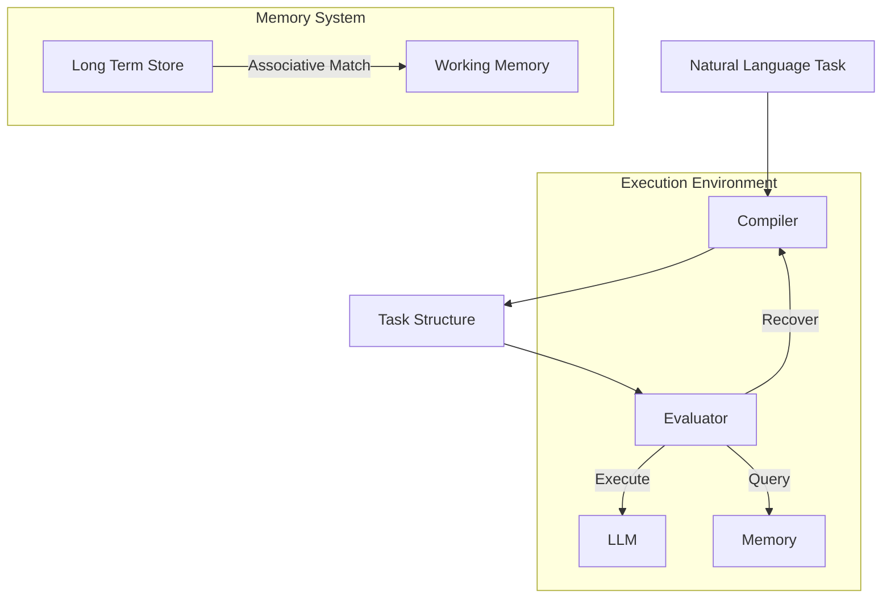

# System-Level README

This **LLM Interpreter** is a DSL that compiles to LLM 'executables'. It uses an associative matching scheme for context management and dynamic template selection, with structured XML task definitions forming a bridge between the LLM and the language's internal representation. 

## Core Architecture

### Intelligent Task Processing


The system translates natural language into structured task workflows while managing:
- Resource constraints
- Error recovery
- Context flow
- Task composition

### Smart Context Management

```xml
<!-- Example: Sequential analysis with context management -->
<task type="sequential">
    <description>Analyze experimental data</description>
    <context_management>
        <inherit_context>subset</inherit_context>
        <accumulate_data>true</accumulate_data>
        <accumulation_format>notes_only</accumulation_format>
    </context_management>
    <steps>
        <task>
            <description>Load and validate raw data</description>
        </task>
        <task>
            <description>Identify key patterns</description>
        </task>
        <task>
            <description>Generate insights report</description>
        </task>
    </steps>
</task>
```

## Key Concepts

### 1. Environment Model
The system uses a Lispy-inspired environment model for clean task composition:

```typescript
interface Environment {
    // Lexical scope for variable bindings
    bindings: Map<string, any>
    
    // Working memory for task execution
    context: Map<string, any>
    
    // Parent environment reference
    outer: Environment | null
    
    // Create child environment with new bindings
    extend(bindings: Map<string, any>): Environment
}
```

Benefits:
- Clear separation of bindings and context
- Predictable variable resolution
- Clean task isolation
- Efficient memory usage

### 2. Associative Memory
Intelligent context management through associative matching:

```typescript
interface MemorySystem {
    // Find relevant context for current task
    getRelevantContextFor(input: ContextQuery): Promise<Context>
    
    // Access global metadata index
    getGlobalIndex(): Promise<GlobalIndex>
    
    // Result structure with context and matches
    interface Context {
        content: string        // Relevant context
        matches: FileMatch[]   // Matching files
    }
}
```

Features:
- Smart context selection
- Efficient metadata indexing
- Resource-aware retrieval
- Automatic relevance matching

### 3. First-Class Functions
Tasks as composable, first-class procedures:

```xml
<!-- Example: Reusable data processing function -->
<task type="function">
    <name>process_experimental_data</name>
    <parameters>
        <param name="raw_data" type="DataSet"/>
        <param name="config" type="ProcessingConfig"/>
    </parameters>
    <returns type="ProcessedData"/>
    <body>
        <task type="sequential">
            <step>
                <description>Validate input format</description>
            </step>
            <step>
                <description>Apply processing pipeline</description>
            </step>
            <step>
                <description>Generate quality metrics</description>
            </step>
        </task>
    </body>
</task>
```

Capabilities:
- Parameter binding
- Return value handling
- Composition operators
- Higher-order operations

## Error Recovery

The system implements two robust recovery strategies:

### 1. Resource-Driven Decomposition
When tasks exceed resource limits:
- Automatic task breakdown
- Smart subtask scheduling
- Context preservation
- Result aggregation

### 2. Output Validation & Retry
When tasks fail validation:
- Structured error analysis
- Alternative approach generation
- Incremental refinement
- Result verification

## Advanced Features

### Director-Evaluator Pattern
```xml
<!-- Example: Dynamic code review workflow -->
<task type="director-evaluator">
    <description>Review code changes</description>
    <director>
        <description>Analyze changes and suggest improvements</description>
    </director>
    <evaluator>
        <description>Validate suggestions and check implementation</description>
    </evaluator>
</task>
```

### Composable Operators
Built-in operators for task composition:
- **Sequential**: Ordered execution with context flow
- **Reduce**: Result aggregation with accumulation
- **Map**: Parallel execution (coming soon)


## Further Reading

1. [Task Composition Guide](./docs/tasks.md)
   - Function patterns
   - Operator usage
   - Composition examples

2. [Error Recovery Patterns](./docs/errors.md)
   - Recovery strategies
   - Resource management
   - Error handling patterns

3. [Memory System Guide](./docs/memory.md)
   - Context management
   - Associative matching
   - Resource optimization

4. [Environment Model](./docs/environment.md)
   - Scoping rules
   - Context inheritance
   - Memory management

