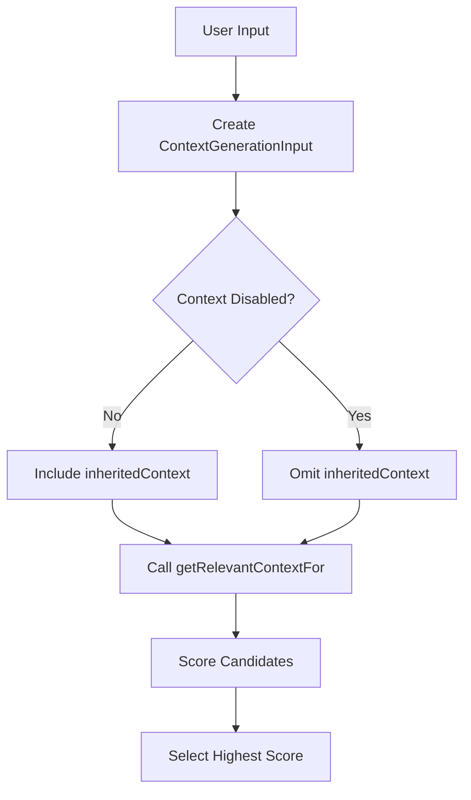

# Architecture Overview

## Problem Statement and Goals

### Atomic Task Matching

The system uses a uniform, heuristic approach for template matching:

- Only atomic tasks have templates; composite tasks are created by combining atomic tasks
- Template matching is performed heuristically by user-defined associative matching tasks with fixed I/O signatures
- Matching logic is uniform for MVP (no operator-specific differences or versioning)
- System always selects the highest-scoring candidate template
- Optional "disable context" flag allows tasks to run without inherited context
- Task results may include optional success score in "notes" field for future adaptive scoring

This document provides a high‑level overview of the system architecture. Detailed technical discussions have been moved into canonical files in the sub‑folders:

- **Patterns:** Core patterns such as Director‑Evaluator, Error Handling, and Resource Management (see files under `system/architecture/patterns/`).
– **Decisions (ADRs):** Architecture Decision Records on topics such as context management and memory system design (see `system/architecture/decisions/`).
– **Q&A and Open Questions:** Clarifications and unresolved issues (see `system/architecture/qa/` and `system/architecture/questions.md`).

## Document Map

**This folder contains:**
 - `overview.md`: This high‑level summary and navigation index.
 - `patterns/`: Detailed technical descriptions of core patterns.
 - `decisions/`: Architecture Decision Records (ADRs) with rationale and scope.
 - `qa/`: Frequently asked questions and clarifications.
 - `questions.md`: A list of open and unresolved architecture questions.

For full technical details on any topic, please refer to the canonical file listed above.

### System Goals
1. Primary Goals
- Provide reliable task automation through structured decomposition and execution
- Ensure consistent task processing despite resource constraints
- Enable robust error recovery without human intervention
- Maintain system coherence across task boundaries

2. Quality Goals
- Predictable resource usage through explicit tracking and limits
- Consistent behavior through standardized protocols and interfaces
- Extensible task handling via template-based architecture
- Maintainable system through clear component boundaries

3. Operational Goals
- Handle varying task complexities through dynamic decomposition
- Support diverse task types through flexible template system
- Preserve critical context across task boundaries
- Manage resources efficiently within defined constraints

### System Constraints

#### Resource Constraints
- Fixed context window size
- Limited turn counts
- Synchronous operation only
- File access via Handler tools only

#### Operational Constraints  
- One Handler per task execution
- Immutable Handler configuration
- No persistent state maintenance
- Template immutability during execution

## Core Patterns

The Director-Evaluator Pattern supports both dynamic and static variants. The static variant pre-compiles the execution sequence—including script execution tasks—for predictable control flow (see [Pattern:DirectorEvaluator:1.1](system/architecture/patterns/director-evaluator.md)).

The system now follows a unified context management model. In addition, task input values are dynamically substituted using the `{{...}}` syntax, allowing the Evaluator to inject lexically scoped variables into task descriptions and input declarations. This explicit binding mechanism (augmented by the optional `from` attribute) improves clarity and flexibility in task execution.

Context is managed via a single `<context_management>` block that distinguishes between:
 - **Inheritance:** (using the new `inherit_context` enumeration)
 - **Accumulation:** (using the boolean `accumulate_data` and the `accumulation_format` setting)

### Error Handling [Pattern:Error:1.0]
Defines how errors propagate and recover across component boundaries.

See [Interface:ErrorHandling:1.0] in system/contracts/interfaces.md for complete specification.

### Resource Management [Pattern:Resource:2.0]
Defines resource usage tracking and lifecycle across components.

#### Core Principles
- Handler-based resource isolation
- Per-task resource tracking
- Context window management
- Memory system integration
- No cross-Handler resource sharing
- Read-only memory access

#### Component Responsibilities

##### Handler
- Owns turn counting per task execution
- Manages context window size
- Tracks token usage
- Enforces resource limits
- Ensures session termination

##### Task System
- Creates Handler instances
- Configures immutable resource limits
- Delegates resource tracking to Handler
- Manages template persistence

##### Memory System
- Maintains task context data
- Provides context management interface
- Maintains global file metadata index
- No file content storage

#### Resource Types and Protocols
- Turn Counter: Per-Handler atomic tracking with strict limits
- Context Window: Token-based size monitoring and enforcement
- Memory Resources: Short-term task context with clear boundaries
- Resource Release: Coordinated cleanup and state invalidation
- Error Handling: Resource exhaustion detection and preservation

See [Contract:Resources:2.0] in system/contracts/resources.md for complete specification.

### Task Execution [Pattern:TaskExecution:2.0]
Defines how tasks are structured, executed, and managed.

Key concepts:
- Template-based definition
- Handler-managed execution
- Resource-aware processing
- XML-based protocols

See [Contract:Tasks:2.0] in system/contracts/protocols.md for complete specification.

## Component Architecture

The system consists of four core components working together to process, execute, and manage tasks:

### Compiler [Component:Compiler:1.0]
Task parsing and transformation component.
- Translates natural language to XML/AST
- Validates against XML schema
- Handles task transformation
- Manages template validation

See [Contract:Integration:CompilerTask:1.0] for integration specification.

### Evaluator [Component:Evaluator:1.0]
Execution control component.
- Controls AST processing and execution
- Manages failure recovery
- Tracks resource usage
- Handles reparse requests

See [Contract:Integration:EvaluatorTask:1.0] for integration specification.

### Task System [Component:TaskSystem:1.0]
Task execution and management component.
- Coordinates task execution via Handlers
- Manages task templates and matching
- Interfaces with Memory System
- Processes XML input/output

See components/task-system/README.md for complete specification.

### Memory System [Component:Memory:3.0]
Metadata management component.
- Maintains global file metadata index
- Provides metadata for associative matching without ranking or prioritization
- Supplies metadata for file-based lookup and partial matching
- Does not store file content or task context
- Does not allocate or manage resources - only provides matching services

See [Contract:Integration:TaskMemory:2.0] for integration specification.

## Component Integration

### Core Integration Patterns
Components interact through defined contracts:

#### Compiler ↔ Task System
- Task parsing coordination
- Schema validation
- Template utilization

#### Evaluator ↔ Compiler
- AST execution feedback
- Reparse requests
- Resource usage updates

#### Task System ↔ Evaluator
- Execution coordination
- Resource allocation
- State management

#### Task System ↔ Memory System
- Context management
- Metadata index access
- Associative matching support

See system/contracts/interfaces.md for complete contract specifications.

### Resource Ownership
- Handlers own task resources
- Memory system owns context storage
- Task system coordinates allocation
- Clean resource release required

See system/contracts/resources.md for complete ownership model.

### System-Wide Protocols
- XML-based task definitions and protocols
- Standard error propagation
- Resource usage tracking
- Context management

---

### Sequential Task Management [Pattern:SequentialTask:2.0]

The system maintains **explicit task history** for sequential operations. This design clarifies how multiple steps in a single task can share context in a controlled, trackable way, and how partial or final outputs are captured.

1. **Output Tracking**
   - The Evaluator maintains a list of all previous task outputs, keyed by step index or ID.
   - The lifecycle for this history is well-defined; it is preserved until the sequence finishes.
   - Storage must remain resource-aware to avoid memory limit issues. If output is large, the evaluator can store a summarized version or notes-only.

2. **Context Management**
   - Context inheritance is separated from data accumulation.
   - Three distinct modes of operation are recognized:
     1. **Direct parent context inheritance**: The sub-task uses the same context as its parent, unchanged.
     2. **History-aware associative matching**: The sub-task can optionally reference all previous step outputs as additional matching data.
     3. **Standard associative matching**: The sub-task only uses the normal memory system and the known parent context, ignoring any step-by-step accumulations.

3. **Partial Failures**
   - If a step fails, all previous step outputs remain available in the final (error) output.
   - The final error output includes which step number or ID caused the failure.

4. **Resource Handling**
   - Maximum stored-history size is enforced by the system to prevent out-of-memory or context window exhaustion.
   - The evaluator must handle large output storage carefully, possibly discarding or summarizing to keep track usage in check.
   - Clear cleanup protocols ensure that once the sequence completes (successfully or in error), the stored step outputs are removed.

In summary, **SequentialTask** pattern addresses multi-step tasks with optional or partial data inheritance across steps, ensuring that both resource usage and error behavior remain consistent and predictable.

See system/contracts/protocols.md for protocol specifications.
