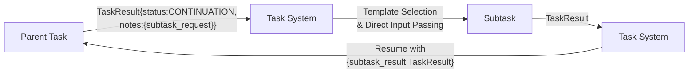

# Director‑Evaluator Pattern [Pattern:DirectorEvaluator:1.1]

**Canonical Reference:** This document is the authoritative description of the Director‑Evaluator Pattern. All extended descriptions in planning or misc files should refer here.

## Overview

The Director-Evaluator pattern is a specialized variant of the unified task‐subtask execution model, implemented in two ways:

1. **Dynamic Variant**: A parent task (the **Director**) produces an initial output that may require evaluation. When the Director's output returns with a `CONTINUATION` status and an `evaluation_request` object in its `notes`, the evaluation subtask is spawned dynamically.

2. **Static Variant**: A predefined task structure of type `director_evaluator_loop` that explicitly defines the Director, Evaluator, and optional script execution steps with clear iteration control.

**Note:** The `evaluation_request` object must include:
 - `type`: a string indicating the evaluation type,
 - `criteria`: a free-form string providing descriptive criteria used for dynamic evaluation template selection via associative matching,
 - `target`: a string representing the target (for example, the bash script command to run or the evaluation focus).

## Pattern Description

### Dynamic Variant

This pattern follows a three-phase flow:

1. **Parent Task (Director):**
   - Generates an initial output based on the user's instructions.
   - May return a result with `status: 'CONTINUATION'` and a populated `evaluation_request` in its `notes`.
   - Uses a `<context_management>` block with `inherit_context` set to `none` to start a new execution chain.

2. **Evaluation Trigger via Continuation:**
   - The evaluation step is triggered dynamically when the Director task returns a `CONTINUATION` status.
   - The embedded `evaluation_request` specifies both:
       - The **bash script** (or external callback mechanism) to execute, and
       - The **target** string that describes the aspects of the output requiring evaluation.
   - The Evaluator uses this information—with associative matching—to select an appropriate evaluation task template.

3. **Child Task (Evaluator):**
   - Is dynamically spawned by the Evaluator when it detects a `CONTINUATION` status along with an `evaluation_request` in the Director's output.
   - Uses a `<context_management>` block with `inherit_context` set to `subset` and `accumulate_data` enabled to incorporate only the relevant context.
   - Executes the evaluation subtask—which may include invoking the specified bash script via the Handler or Evaluator—and feeds its results back to the parent task.

### Static Variant (Director-Evaluator Loop)

The static variant uses a dedicated task type with a standardized structure:

```xml
<task type="director_evaluator_loop">
  <description>{{task_description}}</description>
  <max_iterations>5</max_iterations>
  <context_management>
    <inherit_context>none</inherit_context>
    <accumulate_data>true</accumulate_data>
    <accumulation_format>notes_only</accumulation_format>
    <fresh_context>enabled</fresh_context>
  </context_management>
  <director>
    <description>Generate solution for {{original_prompt}}</description>
    <inputs>
      <input name="original_prompt" from="user_query"/>
      <input name="feedback" from="evaluation_feedback"/>
      <input name="iteration" from="current_iteration"/>
    </inputs>
  </director>
  <evaluator>
    <description>Evaluate solution against {{original_prompt}}</description>
    <inputs>
      <input name="solution" from="director_result"/>
      <input name="original_prompt" from="user_query"/>
    </inputs>
  </evaluator>
  <script_execution>
    <!-- Optional script execution -->
    <command>{{script_path}}</command>
    <timeout>300</timeout>
    <inputs>
      <input name="script_input" from="director_result"/>
    </inputs>
  </script_execution>
  <termination_condition>
    <!-- Optional early termination -->
    <condition>evaluation.success === true</condition>
  </termination_condition>
</task>
```

### Parameter Passing

The Director-Evaluator loop uses direct parameter passing rather than environment variables:



### Result Structure

All task results follow a consistent base structure with extensions for specific needs:

```typescript
// Base task result structure
interface TaskResult {
    content: string;
    status: "COMPLETE" | "CONTINUATION" | "WAITING" | "FAILED";
    notes: {
        [key: string]: any;
    };
}

// Specialized structure for evaluator feedback
interface EvaluationResult extends TaskResult {
    notes: {
        success: boolean;        // Whether the evaluation passed
        feedback: string;        // Human-readable feedback message
        details?: {              // Optional structured details
            metrics?: Record<string, number>; // Optional evaluation metrics
            violations?: string[];            // Specific validation failures
            suggestions?: string[];           // Suggested improvements
            [key: string]: any;               // Extension point
        };
        scriptOutput?: {         // Present when script execution is involved
            stdout: string;      // Standard output from script
            stderr: string;      // Standard error output from script
            exitCode: number;    // Exit code from script
        };
    };
}
```

### Example Workflow

Below is a conceptual example (in pseudocode) illustrating the updated director-evaluator flow. In this scenario, the Director task returns a result with `status: 'CONTINUATION'` and an embedded `evaluation_request`:

```typescript
// Example TaskResult returned by the Director task
const taskResult: TaskResult = {
    content: "Initial solution output...",
    status: 'CONTINUATION',
    notes: {
        evaluation_request: {
            type: "bash_script",
            criteria: ["validate", "log"],
            target: "run_analysis.sh"
        }
    }
};
```

Upon receiving this result, the Evaluator:
1. Uses the `evaluation_request` details (including the target string) to perform associative matching and select an appropriate evaluation task template.
2. Dynamically spawns an evaluation subtask (the Child Task) with a `<context_management>` block set to inherit a subset of context.
3. If necessary, invokes the specified bash script callback via the Handler or its own mechanism.
4. Feeds the evaluation results back to the Director, allowing the overall task to continue.

## Integration with the Unified Architecture

### Context Management Defaults

The Director-Evaluator pattern has specific default context management settings:

| Task Type | inherit_context | accumulate_data | accumulation_format | fresh_context |
|-----------|-----------------|-----------------|---------------------|---------------|
| director_evaluator_loop | none | true | notes_only | enabled |
| director (component) | full | false | notes_only | enabled |
| evaluator (component) | full | false | notes_only | enabled |

These defaults can be overridden through explicit configuration:

```xml
<task type="director_evaluator_loop">
  <description>Iterative refinement process</description>
  <context_management>
    <inherit_context>subset</inherit_context>
    <accumulate_data>true</accumulate_data>
    <accumulation_format>full_output</accumulation_format>
    <fresh_context>enabled</fresh_context>
  </context_management>
  <!-- other elements -->
</task>
```

The Director-Evaluator pattern fully embraces the hybrid configuration approach and integrates with the three-dimensional context management model:

- **Inherited Context**: The parent task's context, controlled by `inherit_context` setting.
- **Accumulated Data**: The step-by-step outputs collected during sequential execution, controlled by `accumulate_data` setting.
- **Fresh Context**: New context generated via associative matching, controlled by `fresh_context` setting.

When the context_management block is omitted, the operator-specific defaults apply. When present, explicit settings override the defaults, providing both consistency and flexibility.

### Script Execution Integration

When a script execution step is included:
- The script receives the Director's output as input
- Script output (stdout, stderr, exit code) is captured
- Results are passed to the Evaluator for processing
- The Evaluator considers both the original output and script results

## Relationship to Subtask Spawning

The Director-Evaluator Loop and Subtask Spawning mechanism are complementary features:

| Director-Evaluator Loop | Subtask Spawning Mechanism |
|-------------------------|----------------------------|
| Specialized higher-level pattern | General-purpose primitive |
| Built for iterative refinement | Ad-hoc dynamic task creation |
| Predefined iteration structure | Flexible composition pattern |
| Built-in termination conditions | Manual continuation control |

**When to use Director-Evaluator Loop:**
- Iterative refinement processes
- Create-evaluate feedback cycles
- Multiple potential iterations
- External validation via scripts

**When to use Subtask Spawning:**
- One-off subtask creation
- Dynamic task composition
- Task flows that aren't primarily iterative
- Complex task trees with varying subtypes

## Conclusion

The Director-Evaluator pattern provides a structured approach to iterative refinement, with both dynamic and static variants. It uses direct parameter passing for clean data flow and integrates fully with the unified context management model. This approach ensures flexibility and seamless integration within the overall task execution architecture.
