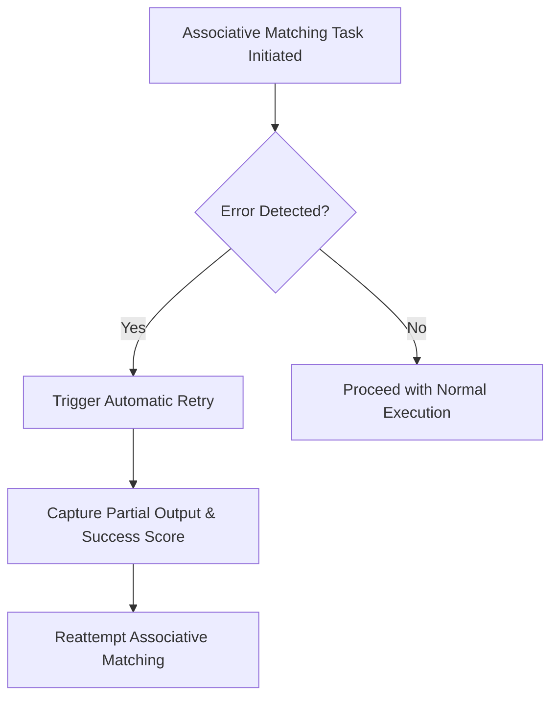

# Error Handling and Recovery Pattern [Pattern:Error:1.0]

**Intended Focus:** This document covers overall error detection, classification, and recovery strategies. For resource‑related cleanup details, see the "Resource Cleanup" subsection below. (For low‑level resource metrics, refer to [Handler Resource Tracking](../decisions/001-memory-system.md) and related docs.)

## 1. Pattern Definition

### 1.1 Purpose
Error handling pattern for the task execution system, focusing on three key concerns:
- Resource exhaustion detection and recovery
- Invalid output handling
- Progress failure management

### 1.2 Context
This pattern is used by:
- [Component:TaskSystem:1.0] for error detection
- [Component:Evaluator:1.0] for error recovery
- [Component:Handler:1.0] for resource monitoring

### 1.3 Core Elements
- Error Type System: See [Type:TaskSystem:TaskError:1.0]
- Recovery Protocols: See [Protocol:Tasks:Reparse:1.0]
- Resource Contracts: See [Contract:Resources:1.0]

## 2. Error Categories

### 2.1 Resource Exhaustion
Handled by [Protocol:Tasks:Reparse:1.0]
[TBD: Complete category specification]

### 2.2 Invalid Output Structure
Related to [Contract:Tasks:TemplateSchema:1.0]
[TBD: Complete category specification]

### 2.3 Failure to Make Progress
[TBD: Progress failure specification]

## 3. Recovery Process

### 3.1 Detection Phase
See [Interface:Handler:ResourceMonitoring:1.0]
[TBD: Detection requirements]

### 3.2 Planning Phase
See [Component:Evaluator:1.0] for recovery planning.
[TBD: Planning requirements]

### 3.3 Execution Phase
See [Protocol:Tasks:Reparse:1.0] for execution details.
[TBD: Execution requirements]

- **Associative Matching Failures:** If an associative matching task encounters an error—such as insufficient context or partial output—it will automatically trigger a retry. These errors will include any partial output and, if available, an optional success score (recorded in the task's `notes` field) to support future adaptive behavior.

#### Error Recovery Flow for Associative Matching

### 3.4 Validation Phase
[TBD: Validation requirements]

## 4. Pattern Examples
See components/task-system/impl/examples.md for concrete examples.
[TBD: Additional examples]

## 5. Known Limitations
[TBD: Pattern limitations]

## 6. Related Patterns
- [Pattern:ResourceManagement:1.0]
- [Pattern:TaskExecution:1.0]
