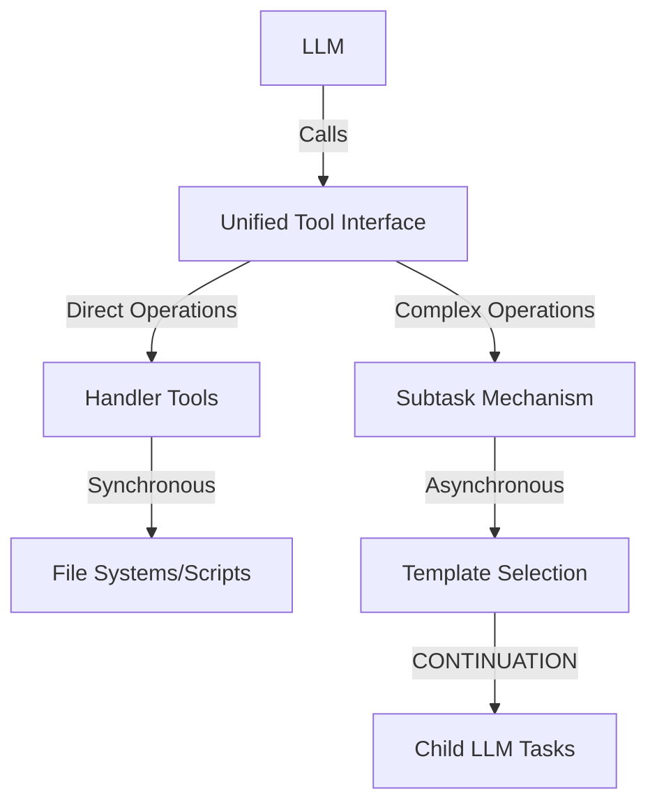

# Unified Tool Interface Pattern [Pattern:ToolInterface:1.0]

## Purpose

Define a consistent tool-based delegation model for LLMs that unifies direct operations (file I/O, scripts) and complex operations (subtasks, evaluations) under a common interface while maintaining separate implementation mechanisms.

## Pattern Description

The Unified Tool Interface pattern separates the LLM-facing interface from the underlying implementation mechanisms:

1. **Interface Layer**: What the LLM sees and interacts with
   - Consistent tool-based invocation pattern
   - Standardized parameter schemas
   - Unified error handling

2. **Implementation Layer**: How tools are executed
   - **Direct Tools**: Synchronous execution via Handler
   - **Subtask Tools**: Asynchronous execution via CONTINUATION mechanism



## Interface vs. Implementation

### What the LLM Sees

From the LLM's perspective, all tools share a common invocation pattern:

```python
# Direct tool example
result = tools.readFile("path/to/file")

# Subtask tool example
result = tools.analyzeData({
  "data": fileContent,
  "method": "statistical" 
})
```

### How It's Implemented

Behind the interface, tools operate differently:

1. **Direct Tools**:
   - Executed synchronously by the Handler
   - No complex context management
   - Predictable resource usage
   - Examples: file operations, script execution, API calls

2. **Subtask Tools**:
   - Implemented via CONTINUATION mechanism
   - Managed by Task System and Evaluator
   - Full context management capabilities
   - Depth tracking and cycle detection
   - Examples: data analysis, creative generation, complex reasoning

## Implementation Details

### Handler Responsibilities

The Handler component exposes both types of tools through a unified registry:

```typescript
interface ToolRegistry {
  registerDirectTool(name: string, handler: Function): void;
  registerSubtaskTool(name: string, templateHints: string[]): void;
  
  // Called by LLM through tool interface
  invokeTool(name: string, params: any): Promise<any>;
}
```

When a tool is invoked:
1. Handler determines tool type (direct or subtask)
2. For direct tools: executes immediately and returns result
3. For subtask tools: creates CONTINUATION with SubtaskRequest and yields

### Task System Integration

For subtask tools, the Task System:
1. Receives CONTINUATION status with subtask_request
2. Selects appropriate template using associative matching
3. Executes subtask with context management
4. Returns result to parent task

## Usage Examples

### Direct Tool Example

```typescript
// LLM invocation
const fileContent = tools.readFile("data.csv");

// Implementation (synchronous via Handler)
async function readFile(path: string): Promise<string> {
  return await fs.readFile(path, 'utf8');
}
```

### Subtask Tool Example

```typescript
// LLM invocation
const analysis = tools.analyzeData({
  "data": fileContent,
  "method": "statistical"
});

// Implementation (asynchronous via CONTINUATION)
async function analyzeData(params: any): Promise<any> {
  return {
    status: "CONTINUATION",
    notes: {
      subtask_request: {
        type: "atomic",
        description: `Analyze data using ${params.method} method`,
        inputs: { data: params.data, method: params.method },
        template_hints: ["data_analysis", "statistics"]
      }
    }
  };
}
```

## Selection Criteria

Use **Direct Tools** when:
- Operations are deterministic with predictable outputs
- No complex reasoning is required
- Response format is simple and structured
- Resource usage is predictable

Use **Subtask Tools** when:
- Complex reasoning or creativity is required
- Dynamic template selection would be beneficial
- Operation might involve multiple steps or iterations
- Context management needs are sophisticated

## Integration with Other Patterns

This pattern complements:
- [Pattern:DirectorEvaluator:1.1] - Can use both mechanism types
- [Pattern:SubtaskSpawning:1.0] - Provides tool interface for spawning
- [Pattern:ContextFrame:1.0] - Works with context management model
- [Pattern:Error:1.0] - Unified error handling across mechanisms

## Constraints

1. **Naming Consistency**: Tool names must be unique across both direct and subtask tools
2. **Parameter Validation**: All tools must validate parameters regardless of implementation
3. **Error Propagation**: Error handling must be consistent across both mechanisms
4. **Resource Tracking**: Both mechanisms must track resource usage appropriately

## Implementation Guidance

1. Register direct tools during Handler initialization
2. Define subtask tools in the TaskLibrary with template hints
3. Implement invocation routing in the Handler
4. Ensure consistent error handling in both paths
5. Provide clear documentation of available tools to the LLM
