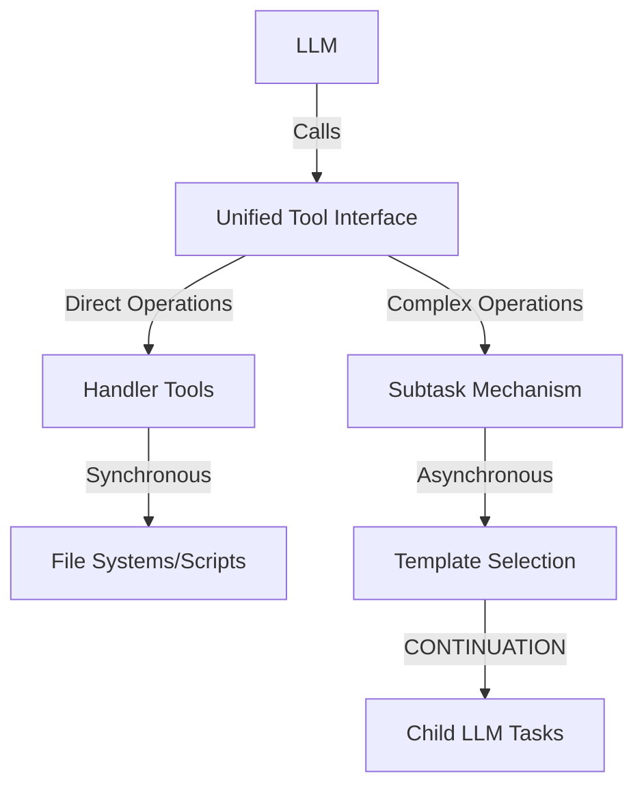
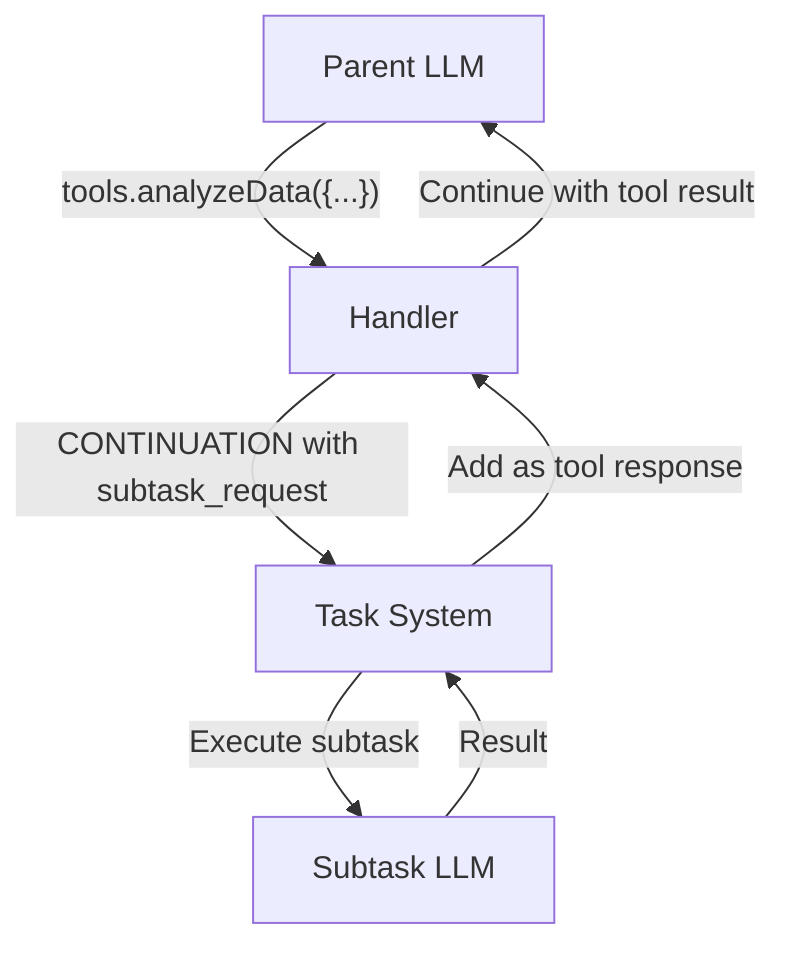

# Unified Tool Interface Pattern [Pattern:ToolInterface:1.0]

## Purpose

Define a consistent tool-based delegation model for LLMs that unifies direct operations (file I/O, scripts) and complex operations (subtasks, evaluations) under a common interface while maintaining separate implementation mechanisms.

## Pattern Description

The Unified Tool Interface pattern separates the LLM-facing interface from the underlying implementation mechanisms:

1. **Interface Layer**: What the LLM sees and interacts with
   - Consistent tool-based invocation pattern
   - Standardized parameter schemas
   - Unified error handling

2. **Implementation Layer**: How tools are executed
   - **Direct Tools**: Synchronous execution via Handler
   - **Subtask Tools**: Asynchronous execution via CONTINUATION mechanism



## Interface vs. Implementation

### What the LLM Sees

From the LLM's perspective, all tools share a common invocation pattern:

```python
# Direct tool example
result = tools.readFile("path/to/file")

# Subtask tool example
result = tools.analyzeData({
  "data": fileContent,
  "method": "statistical" 
})
```

For implementation details of direct tools, see [Implementation:DirectTools:1.0] in `/components/handler/impl/tool-execution.md`.

### How It's Implemented

Behind the interface, tools operate differently:

1. **Direct Tools**:
   - Executed synchronously by the Handler
   - No complex context management
   - Predictable resource usage
   - Examples: file operations, script execution, API calls

2. **Subtask Tools**:
   - Implemented via CONTINUATION mechanism
   - Managed by Task System and Evaluator
   - Full context management capabilities
   - Depth tracking and cycle detection
   - Examples: data analysis, creative generation, complex reasoning

For implementation details of subtask tools, see [Implementation:SubtaskTools:1.0] in `/components/task-system/impl/subtask-tools.md`.

## Subtask Results as Tool Responses

When a subtask tool is called, the system implements a streamlined approach that preserves session continuity:



### Key Benefits
1. **Session Preservation**: The parent Handler session is maintained throughout execution
2. **Natural Conversation Flow**: From the LLM's perspective, this is just a tool call and response
3. **No Special Methods**: No need for `resumeTask()` or similar special continuation methods
4. **Simplified Implementation**: Clean component boundaries with clear responsibilities

### Example Flow
1. Parent LLM calls a subtask tool (e.g., `tools.analyzeData({...})`)
2. Handler recognizes this as a subtask tool and returns CONTINUATION with subtask_request
3. Task System executes the subtask as a separate LLM interaction
4. Task System adds the subtask result to the parent's session as a tool response
5. Parent LLM continues execution with the tool result in its conversation history

This approach eliminates the need for the LLM to understand continuation concepts - it simply sees its tool call and the corresponding response.

## Selection Criteria

Use **Direct Tools** when:
- Operations are deterministic with predictable outputs
- No complex reasoning is required
- Response format is simple and structured
- Resource usage is predictable

Use **Subtask Tools** when:
- Complex reasoning or creativity is required
- Dynamic template selection would be beneficial
- Operation might involve multiple steps or iterations
- Context management needs are sophisticated

## Integration with Other Patterns

This pattern complements:
- [Pattern:DirectorEvaluator:1.1] - Can use both mechanism types
- [Pattern:SubtaskSpawning:1.0] - Provides tool interface for spawning
- [Pattern:ContextFrame:1.0] - Works with context management model
- [Pattern:Error:1.0] - Unified error handling across mechanisms

## Constraints

1. **Naming Consistency**: Tool names must be unique across both direct and subtask tools
2. **Parameter Validation**: All tools must validate parameters regardless of implementation
3. **Error Propagation**: Error handling must be consistent across both mechanisms
4. **Resource Tracking**: Both mechanisms must track resource usage appropriately

### User Input Request Tool

The system provides a standardized tool for requesting user input when additional information is needed from the user during task execution.

For implementation details of user input tools, see [Implementation:UserInputTools:1.0] in `/components/handler/impl/tool-execution.md`.
