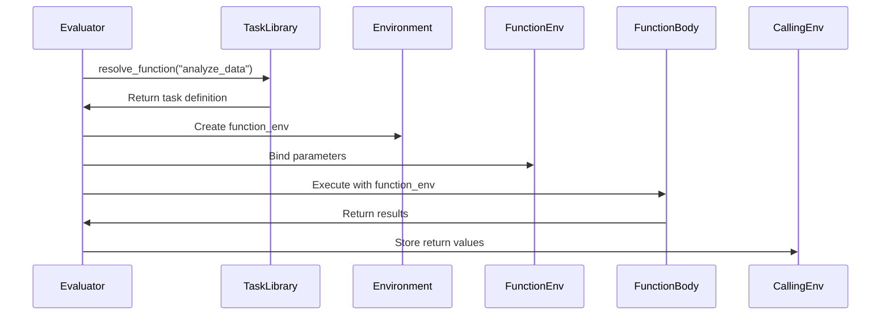

<approach 1>
# DSL Function Calling Implementation

## Initial Problem Statement
Okay, let's tackle the problem of implementing function calling in the DSL. First, I need to figure out how to represent the task library in memory. The user mentioned considering whether it should be part of the Evaluator Environment or separate.

## Architecture Considerations

### Environment Structure
Hmm, the Evaluator Environment already handles variable bindings and context. Adding the task library there might clutter it. Maybe a separate data structure would be better. But then, how do tasks get accessed during evaluation? Maybe the Evaluator should have a reference to a TaskLibrary component that's separate from the runtime environment.

### Task Organization
Next, organizing tasks by type. The user suggested subtypes like associative matching tasks. So perhaps a hierarchical structure where tasks are categorized by their type (atomic, composite) and further by subtypes (director, evaluator, etc.). But having both a subtype hierarchy and an in-memory structure could be redundant. Wait, maybe the in-memory structure mirrors the subtype hierarchy. That way, when looking up tasks, the system can filter by type efficiently.

## Data Structure Design

For the data structure, maybe a dictionary where keys are task types, and values are lists or another dictionary of tasks:

```python
task_library = {
    'atomic': {
        'director': [task1, task2],
        'evaluator': [task3]
    },
    'composite': {
        'sequential': [task4],
        'reduce': [task5]
    }
}
```

This allows quick access by type and subtype. But how does this map to the XML definitions? Each task in the library would need to have metadata indicating its type and subtype. So when loading tasks from files, the parser would categorize them into this structure.

## Task Loading Strategy

Now, loading tasks from files. The user mentioned inlining them in the AST versus referencing. For a minimal implementation, inlining might be easier. Each task definition in the XML could be parsed into an AST node and stored in the task library. But for scalability, references would be better. Maybe tasks are stored in the library with unique names, and the AST nodes reference these names. So during evaluation, the Evaluator looks up the task by name from the library.

### Composite Task Handling
But how to handle composite tasks that are built from other tasks? Their ASTs would reference other task names, which are resolved at evaluation time. That way, the library acts as a registry of available tasks, both atomic and composite.

## Implementation Steps

1. Parse task definitions from XML files into an in-memory TaskLibrary structure, organized by type and subtype
2. When evaluating an AST, resolve task references by looking them up in the TaskLibrary
3. For composite tasks, recursively resolve each subtask from the library

This approach keeps the Evaluator Environment focused on runtime bindings and context, while the TaskLibrary manages the available procedures.

## Function Calling Implementation

### First-Class Functions
Now, considering function calling as first-class citizens. If tasks are treated like functions, they need to accept arguments and return values. The existing input system using from attributes and variable substitution can handle arguments. So when a task is called, its inputs are bound to the current environment's variables, and the output is captured into a variable for subsequent tasks.

### Parameter Handling
But for this to work as function calls, the DSL needs a way to define parameters and return values explicitly. Maybe adding `<parameters>` and `<returns>` sections to the task XML. Then, when a task is called, the Evaluator binds the parameters from the current environment and stores the return values into specified variables.

## Technical Implementation Details

### 1. Task Library Data Structure
```python
class TaskLibrary:
    def __init__(self):
        self.tasks = {
            'atomic': defaultdict(dict),    # subtype -> {name: task}
            'composite': defaultdict(dict)  # operator_type -> {name: task}
        }
        self.functions = {}  # Unified function registry
```

### 2. Memory Organization
```typescript
interface Environment {
    variables: Map<string, any>
    parent?: Environment
    task_library: TaskLibrary  // Reference to shared library
}
```

### 3. Type Hierarchy Implementation
```xml
<!-- XML Task Definition -->
<task type="atomic" subtype="assoc_match" name="find_context">
  <inputs><param name="query"/></inputs>
  <outputs><return name="matches"/></outputs>
</task>
```

### 4. Task Loading & Resolution
```python
def load_tasks(evaluator_env: Environment):
    # Load from files
    for xml_file in task_files:
        task = parse_xml_task(xml_file)
        # Store in appropriate hierarchy branch
        if task.type == 'atomic':
            evaluator_env.task_library.tasks['atomic'][task.subtype][task.name] = task
        else:
            evaluator_env.task_library.tasks['composite'][task.operator][task.name] = task
        # Also register as function
        evaluator_env.task_library.functions[task.name] = task
```

### 5. Function Calling Mechanism
```python
class FunctionCall(ASTNode):
    def eval(self, env: Environment):
        # Resolve function from library
        func = env.task_library.functions.get(self.func_name)
        
        # Create new environment for function execution
        func_env = env.extend()
        
        # Bind parameters
        for param, arg_expr in zip(func.parameters, self.args):
            func_env.variables[param] = eval(arg_expr, env)
            
        # Execute function body
        result = eval(func.body, func_env)
        
        # Process returns
        for return_var in func.returns:
            env.variables[return_var] = result[return_var]
```

## Implementation Notes

### Task Type Hierarchy
Maintain both XML subtype attributes and in-memory hierarchy:

```python
# XML mapping
TASK_TYPE_MAP = {
    ('atomic', 'director'): DirectorTask,
    ('atomic', 'evaluator'): EvaluatorTask,
    ('composite', 'sequential'): SequentialTask
}
```

### Function Resolution
During evaluation, functions are resolved through:

```python
def resolve_function(name: str, env: Environment):
    # Check composite tasks first
    for op_type in env.task_library.tasks['composite']:
        if name in env.task_library.tasks['composite'][op_type]:
            return env.task_library.tasks['composite'][op_type][name]
    
    # Check atomic tasks
    for subtype in env.task_library.tasks['atomic']:
        if name in env.task_library.tasks['atomic'][subtype]:
            return env.task_library.tasks['atomic'][subtype][name]
    
    raise FunctionNotFoundError(name)
```

### Execution Workflow


## Design Advantages

- Clear separation between runtime environment and task definitions
- Efficient type-based lookup through hierarchical organization
- Unified function calling interface for both atomic/composite tasks
- Maintains compatibility with existing XML task definitions
- Allows gradual migration from inline ASTs to first-class functions

This approach satisfies the requirements while maintaining architectural consistency with the existing error handling and resource management patterns.
</approach 1>

<approach 2>
# DSL Function Implementation Analysis

## Initial Problem Overview
Okay, let's tackle these questions one by one. The user is brainstorming how to implement function calling in their DSL, and they have several related questions about data structures, task libraries, loading tasks, and adding a 'cond' primitive. Let's break down each part.

## Task Library Structure

### Location Considerations
First, they need to decide on a data structure for the in-memory task library. The options are keeping it in the Evaluator Environment or a separate structure. Since tasks might be used across different evaluations, having a separate task library makes sense. It allows for better separation of concerns—environment holds runtime state, while the task library is a static resource.

### Task Organization
Next, organizing tasks by type. They mention subtypes like associative matching tasks. Using a hierarchical structure where tasks are categorized by type (atomic, composite, etc.) and further by subtypes (director, evaluator, associative) would help in efficient lookup. Maybe a dictionary with keys as task types and values as lists or another dictionary of tasks. This way, when the evaluator needs a specific type, it can quickly filter candidates.

### Hierarchy vs. Structure
Regarding redundancy between subtype hierarchy and in-memory structure: It's not redundant. The subtype hierarchy defines the taxonomy and behavior, while the in-memory structure is about storage and access. They need a mapping, like each task having a 'type' attribute that points to its subtype, allowing the in-memory library to organize tasks based on these types for quick retrieval.

## Implementation Aspects

### Task Loading
Loading tasks from files: For the minimum implementation, inlining tasks into the AST might be simpler. Each task definition in a file could be parsed into an AST node and added to the task library. Later, references can be used for efficiency, especially if tasks are reused. Initially, inlining avoids dealing with reference resolution complexities.

### Conditional Primitive
Adding 'cond' as a primitive: This requires conditional execution based on task outputs. To bridge task outputs (which might be strings or JSON) to conditions, enforcing JSON formatting on outputs would help. The evaluator can parse JSON outputs into Python types, allowing 'cond' to evaluate these. For example, a task outputting `{"valid": true}` can be used in a condition.

### Output Formatting
JSON formatting for task outputs: This adds structure, making it easier to extract values for conditions. The evaluator can have a step that parses the output, and if it's invalid JSON, it's a task failure. This enforces a contract between tasks and the DSL's control structures.

## Technical Implementation

### 1. Task Library Data Structure
```python
class TaskLibrary:
    def __init__(self):
        # Hierarchical organization: Type -> Subtype -> Tasks
        self.tasks = {
            'atomic': {
                'director': [],
                'evaluator': [],
                'assoc_matching': []
            },
            'composite': {
                'sequential': [],
                'reduce': []
            }
        }
        
    def add_task(self, task: TaskDefinition):
        self.tasks[task.type][task.subtype].append(task)

# Part of Evaluator Environment
class EvaluatorEnv:
    def __init__(self, task_lib: TaskLibrary):
        self.task_library = task_lib  # Shared reference
        self.variables = {}  # Execution context
        self.context_stack = []
```

### 2. Task Organization Strategy
```python
class TaskDefinition:
    def __init__(self, name, type, subtype, schema):
        self.name = name
        self.type = type        # Primary category (atomic/composite)
        self.subtype = subtype  # Specialization (director/assoc_matching)
        self.schema = schema    # XML schema or function signature
```

### 3. Task Loading Implementation
```python
# Minimum Viable Implementation (Inline AST)
def load_tasks(ast):
    task_lib = TaskLibrary()
    
    for node in ast.find_nodes('task_definition'):
        task_def = TaskDefinition(
            name=node.get('name'),
            type=node.get('type'),
            subtype=node.get('subtype', 'default'),
            schema=node  # Inline AST node
        )
        task_lib.add_task(task_def)
        
    return task_lib

# Future Reference-based Loading
class TaskReference:
    def __init__(self, task_name, task_lib):
        self.task_name = task_name
        self.task_lib = task_lib
        
    def resolve(self):
        return self.task_lib.find_task(self.task_name)
```

### 4. Conditional Primitive Implementation
```python
# In Evaluator
def eval_cond(condition, env):
    # Parse last task output as JSON
    try:
        output = json.loads(env.last_output)
    except JSONDecodeError:
        raise TaskFailure("Output must be JSON for conditionals")
        
    # Bridge to Python types
    return evaluate_condition(condition, output)
```

Example DSL usage:
```xml
<cond>
    <case test="$.valid == true">
        <task type="atomic" subtype="success_handler"/>
    </case>
    <case test="$.errors > 0">
        <task type="atomic" subtype="error_handler"/>
    </case>
</cond>
```

## Key Decisions & Rationale

### Separate Task Library
- Maintained as separate structure from environment
- Enables task reuse across executions
- Allows pre-loading/common task pools

### Hierarchical Organization
- Primary types (atomic/composite) as first-level keys
- Subtypes for specialized task handling
- Enables efficient type-based lookup

### JSON Output Formatting
- Required for cond primitive and function calls
- Structured data bridge between tasks
- Validation occurs at conditional evaluation

### Inline AST Initial Loading
- Simplifies MVP implementation
- Avoids reference resolution complexity
- Enables gradual migration to references

### Subtype-InMemory Mapping
- Each task stores both type and subtype
- Memory structure mirrors type hierarchy
- No redundancy - logical org vs physical storage

## Implementation Roadmap

1. Implement base TaskLibrary class with hierarchical storage
2. Add AST parsing for inline task definitions
3. Modify Evaluator to maintain task library reference
4. Implement JSON output validation layer
5. Add conditional execution primitive with JSON parsing
6. (Future) Add reference-based task loading system
7. (Future) Add function abstraction with first-class tasks

## Error Handling

```python
class TaskOutputError(ExecutionError):
    def __init__(self, task_name, output):
        super().__init__(f"Invalid output format from {task_name}")
        self.output = output
        self.error_type = "OUTPUT_FORMAT"
        
class ConditionEvaluationError(ExecutionError):
    def __init__(self, condition, output):
        super().__init__(f"Failed to evaluate condition {condition}")
        self.condition = condition
        self.output = output
```

This solution provides a structured approach to implementing function calling while maintaining flexibility for future extensions. The type-subtype hierarchy enables efficient task organization without redundancy, and the JSON output requirement creates a clear contract for task interoperability.
</approach 2>

<approach 3>
# Task System Implementation Brainstorming

## Initial Context
Okay, let's tackle this brainstorming prompt. The user wants to know how tasks will be loaded from a file—whether they'll be inlined in the AST or referenced, considering that the minimal implementation might inline them but eventually both tasks and composite procedures should be first-class functions.

## Current System Structure
First, I need to recall the existing system structure. From the provided files, the system uses XML task definitions parsed into an AST. The Compiler translates natural language into XML, which is then parsed into an AST by the Parser. The Evaluator processes this AST, executing tasks either directly or decomposing them into subtasks.

## Implementation Approaches

### Minimal Implementation
For the minimal implementation, inlining tasks in the AST makes sense. It's straightforward—each task's definition is directly part of the AST node. That way, when a task is loaded from a file, its entire structure is embedded into the AST. This avoids the complexity of managing references and external lookups during execution, which is good for a simple setup.

### Future Considerations
But looking ahead, the goal is to treat tasks as first-class functions. That suggests that tasks should be referenceable by name or identifier, allowing reuse and composition. So, in the future, the AST nodes would reference tasks by name, and the system would resolve these names to their definitions, which could be stored in a task library or loaded from files as needed.

## Challenges and Considerations
The challenge here is balancing the immediate need for simplicity with the future requirement for abstraction. In the minimal version, inlining keeps things simple. However, transitioning to references later would require a mechanism for task registration, lookup, and possibly dynamic loading.

### Storage Considerations
Another consideration is how tasks are stored. If tasks are in files, the system needs a way to parse and include them. In the initial approach, each file might contain a single task definition that's inlined. Later, files could contain multiple task definitions that are registered in a library, allowing references.

### Composite Procedures
Also, composite procedures (like sequences or reduce operations) should be abstracted. This means that their definitions should be reusable. For example, a "process_data" composite task could be defined once and referenced multiple times in different parts of the AST.

## Implementation Plan

1. **Minimal Implementation**:
   - Tasks are loaded from files and inlined into the AST
   - Each file corresponds to a task
   - When parsed, the entire XML structure becomes part of the AST
   - This avoids reference management but limits reusability

2. **Future Enhancement**:
   - Implement a task library where tasks are stored by name
   - When a task is referenced in the AST (via task name or ID), the Evaluator looks up the definition in the library
   - This allows tasks to be defined once and reused, treating them as first-class functions

3. **Transition Strategy**:
   - Start with inlining, then introduce a task registration system
   - Files can define named tasks that are added to the library
   - AST nodes can then reference these names
   - System resolves references during evaluation

## Technical Implementation Details

### 1. Minimal Viable Implementation (Inlined Tasks)

Tasks will be directly in-lined in the AST during initial implementation.

File loading process:
```xml
<!-- File: data_processing.task.xml -->
<task type="sequential">
  <description>Process experimental dataset</description>
  <steps>
    <task type="atomic">
      <description>Load CSV file</description>
      <inputs>
        <input name="filepath" from="env:data_source"/>
      </inputs>
    </task>
  </steps>
</task>
```

AST representation:
```typescript
{
  type: "Task",
  operator: "sequential",
  children: [{
    type: "Task",
    operator: "atomic",
    source: "inline",  // Directly embedded
    content: "..."
  }]
}
```

Advantages:
- Single-file execution context
- No external resolution complexity
- Immediate validation of complete task structure

### 2. Transitional Hybrid Model (First-Class Reference Support)

Introduce task registry with reference capability:
```xml
<!-- File: task_library.xml -->
<library>
  <task name="load_csv" type="atomic">
    <description>Load CSV file</description>
    <inputs>...</inputs>
  </task>
</library>

<!-- File: workflow.xml -->
<task type="composite">
  <steps>
    <task ref="load_csv"/>  <!-- Reference to registered task -->
    <task type="reduce">...</task>  <!-- Inlined definition -->
  </steps>
</task>
```

AST becomes mixture of direct nodes and references:
```typescript
{
  type: "CompositeTask",
  children: [
    {type: "TaskRef", name: "load_csv"},
    {type: "ReduceTask", content: "..."}
  ]
}
```

### 3. Mature Implementation (First-Class Functions)

Full abstraction with parameterized task units:
```lisp
(define-task process-data [input]
  (sequential
    (load-csv input)
    (clean-data)
    (analyze)))

(execute (process-data "{{data_source}}"))
```

Key characteristics:
- Tasks become addressable units in environment
- Supports higher-order task composition
- Enables dynamic task generation/combination

Reference implementation:
```python
class TaskFunction:
    def __init__(self, ast, params):
        self.ast = ast  # Original task structure
        self.params = params  # Input signature
        self.compiled = None  # Optimized form
        
    def __call__(self, *args):
        return Evaluator.execute(
            self._bind_parameters(args)
        )
```

## Integration with Existing Components

### Compiler Changes

Phase 1: Direct AST embedding
```python
def parse_task_file(path):
    xml = load_xml(path)
    return ASTNode.from_xml(xml)  # Full inlining
```

Phase 2+: Reference resolution
```python
class TaskCompiler:
    def __init__(self):
        self.registry = TaskRegistry()
        
    def compile(self, xml_node):
        if xml_node.tag == 'task-ref':
            return self.registry.lookup(xml_node.attrib['name'])
        else:
            return compile_inline(xml_node)
```

### Evaluator Modifications

Handle both direct and reference-based execution:
```python
class Evaluator:
    def eval_node(self, node, env):
        if node.type == 'task-ref':
            task_def = env.lookup_task(node.name)
            return self.eval(task_def.ast, env)
        else:
            # Standard evaluation logic
            ...
```

## Transition Plan

### Immediate Next Steps
- Implement basic XML inlining in compiler
- Add AST serialization/deserialization
- Document inline task format

### Q3 2024 - Reference Support
- Add task registry component
- Implement XML reference syntax
- Develop environment lookup mechanisms
- Update error handling for missing references

### Q4 2024 - First-Class Functions
- Introduce function definition syntax
- Implement closure support for parameter binding
- Add task composition operators
- Optimize via AST caching/compilation

This progression maintains backward compatibility while enabling gradual adoption of more abstract task representations, aligning with the system's evolution from direct XML execution to sophisticated function-based workflows.
</approach 3>
