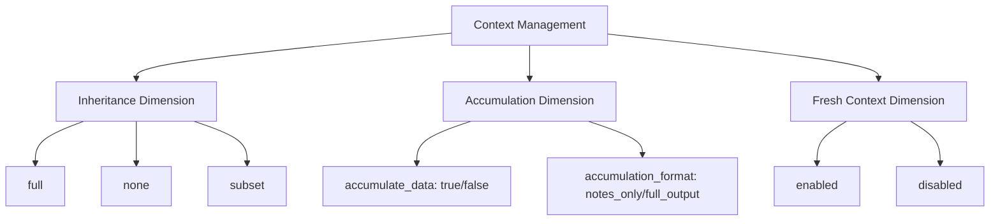

# Context Management Implementation [Implementation:EvaluatorContextManagement:1.0]

## Purpose
This document describes how the Evaluator implements context management, including the three-dimensional context model, inheritance, accumulation, and fresh context generation.

## Related Documents
- [Component:Evaluator:1.0](../README.md)
- [Pattern:ContextFrame:1.0](../../../system/architecture/patterns/context-frames.md)
- [ADR 14: Operator Context Configuration](../../../system/architecture/decisions/completed/014-operator-ctx-config.md)

## Three-Dimensional Context Model

The Evaluator implements a three-dimensional context management model:

1. **Inheritance Dimension** (controlled by `inherit_context`):
   - `full`: Inherits complete parent context
   - `none`: No context inheritance
   - `subset`: Inherits only relevant context based on associative matching

2. **Accumulation Dimension** (controlled by `accumulate_data` and `accumulation_format`):
   - `accumulate_data`: Boolean controlling whether previous step outputs are accumulated
   - `accumulation_format`: Controls whether to store `notes_only` or `full_output`

3. **Fresh Context Dimension** (controlled by `fresh_context`):
   - `enabled`: Generates new context via associative matching
   - `disabled`: No fresh context generation



## Context Management Implementation

The Evaluator implements context management with these components:

1. **Configuration Processing**:
   ```typescript
   function processContextConfig(node: ASTNode, defaultConfig: ContextConfig): ContextConfig {
     // Start with operator-specific defaults
     const config = { ...defaultConfig };
     
     // Override with explicit configuration if present
     if (node.contextManagement) {
       if (node.contextManagement.inheritContext) {
         config.inheritContext = node.contextManagement.inheritContext;
       }
       if (node.contextManagement.accumulateData !== undefined) {
         config.accumulateData = node.contextManagement.accumulateData;
       }
       if (node.contextManagement.accumulationFormat) {
         config.accumulationFormat = node.contextManagement.accumulationFormat;
       }
       if (node.contextManagement.freshContext) {
         config.freshContext = node.contextManagement.freshContext;
       }
     }
     
     // Validate mutual exclusivity constraint
     if ((config.inheritContext === 'full' || config.inheritContext === 'subset') && 
         config.freshContext === 'enabled') {
       throw new ConfigurationError(
         'Invalid configuration: inherit_context cannot be "full" or "subset" when fresh_context is "enabled"'
       );
     }
     
     return config;
   }
   ```

2. **Context Preparation**:
   ```typescript
   async function prepareContext(config: ContextConfig, env: Environment, node: ASTNode): Promise<any> {
     let context = null;
     
     // Handle inheritance
     if (config.inheritContext === 'full') {
       context = env.getContext();
     } else if (config.inheritContext === 'subset') {
       context = await getRelevantSubset(env.getContext(), node);
     }
     
     // Handle fresh context generation
     if (config.freshContext === 'enabled') {
       const freshContext = await memorySystem.getRelevantContextFor(node);
       context = freshContext;
     }
     
     // Handle file paths if present
     if (node.filePaths && node.filePaths.length > 0) {
       const fileContents = await loadSpecifiedFiles(node.filePaths);
       context = mergeContexts(context, fileContents);
     }
     
     return context;
   }
   ```

3. **Accumulation Handling**:
   ```typescript
   function accumulateResults(results: TaskResult[], config: ContextConfig): any {
     if (!config.accumulateData) {
       return null;
     }
     
     if (config.accumulationFormat === 'notes_only') {
       return results.map(r => r.notes);
     } else {
       return results;
     }
   }
   ```

## Context Inheritance Implementation

The Evaluator implements context inheritance through environment chaining:

1. **Full Inheritance**:
   - The child task's environment has the same context as the parent
   - All context data is available to the child task
   - No associative matching is performed

2. **No Inheritance**:
   - The child task's environment has a new, empty context
   - No parent context data is available
   - Fresh context may be generated if enabled

3. **Subset Inheritance**:
   - The child task's environment has a subset of the parent's context
   - Only relevant context data is included
   - Relevance is determined by associative matching

```typescript
function createTaskEnvironment(parentEnv: Environment, config: ContextConfig, node: ASTNode): Environment {
  let context = null;
  
  if (config.inheritContext === 'full') {
    context = parentEnv.getContext();
  } else if (config.inheritContext === 'subset') {
    context = getRelevantSubset(parentEnv.getContext(), node);
  }
  
  return new Environment(parentEnv, context);
}
```

## Fresh Context Generation

The Evaluator generates fresh context through associative matching:

1. **Matching Process**:
   - The task description and inputs are used for matching
   - The Memory System's `getRelevantContextFor` method is called
   - The result is used as the task's context

2. **Integration with Inheritance**:
   - Fresh context generation is mutually exclusive with context inheritance
   - If `fresh_context` is `enabled`, `inherit_context` must be `none`
   - This prevents potential context duplication

```typescript
async function generateFreshContext(node: ASTNode): Promise<any> {
  const contextInput = {
    description: node.description,
    inputs: node.inputs,
    disableContext: node.disableContext || false
  };
  
  return await memorySystem.getRelevantContextFor(contextInput);
}
```

## Associative Matching Invocation

The Evaluator invokes associative matching for context generation:

1. **Input Preparation**:
   ```typescript
   function prepareContextGenerationInput(node: ASTNode): ContextGenerationInput {
     return {
       description: node.description,
       inputs: node.inputs || {},
       disableContext: node.disableContext || false
     };
   }
   ```

2. **Matching Invocation**:
   ```typescript
   async function invokeAssociativeMatching(input: ContextGenerationInput): Promise<any> {
     try {
       return await memorySystem.getRelevantContextFor(input);
     } catch (error) {
       throw new ContextRetrievalError(
         `Failed to retrieve context: ${error.message}`,
         { originalError: error }
       );
     }
   }
   ```

3. **Result Processing**:
   ```typescript
   function processMatchingResult(result: any): any {
     // Extract and validate context data
     if (!result || !result.context) {
       throw new ContextParsingError('Invalid context result structure');
     }
     
     return result.context;
   }
   ```

## File Paths Integration

The Evaluator integrates the `file_paths` feature with context management:

1. **File Path Processing**:
   ```typescript
   async function processFilePaths(filePaths: string[]): Promise<any> {
     const fileContents = {};
     
     for (const path of filePaths) {
       try {
         const content = await handler.readFile(path);
         fileContents[path] = content;
       } catch (error) {
         // Log warning but continue
         console.warn(`Failed to read file ${path}: ${error.message}`);
       }
     }
     
     return formatFileContents(fileContents);
   }
   ```

2. **Context Integration**:
   ```typescript
   function mergeFilePathsWithContext(context: any, fileContents: any): any {
     if (!context) {
       return fileContents;
     }
     
     // Merge file contents with existing context
     return {
       ...context,
       specifiedFiles: fileContents
     };
   }
   ```

3. **Interaction with Other Dimensions**:
   - File paths are processed regardless of other context settings
   - When used with `inherit_context="subset"`, specified files become the subset
   - When used with `fresh_context="enabled"`, files are included alongside fresh context
