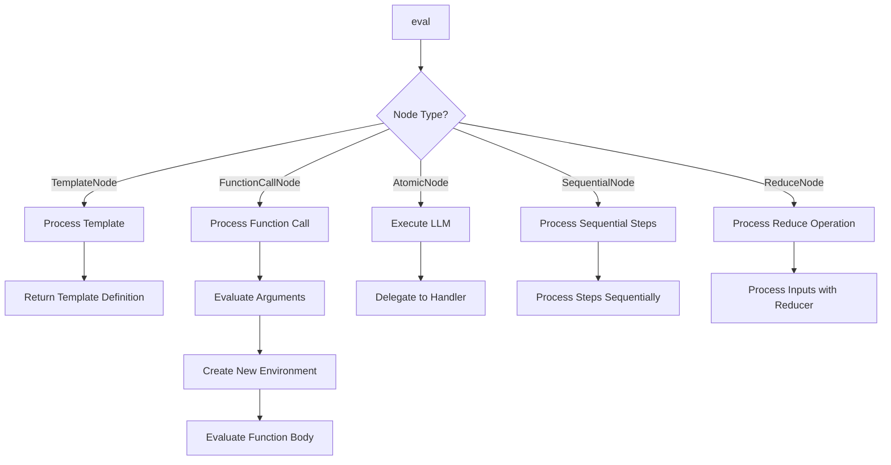

# Evaluator Design [Implementation:EvaluatorDesign:1.0]

## Purpose
This document describes the internal design and implementation of the Evaluator component, focusing on its execution model, environment handling, and core processing logic.

## Related Documents
- [Component:Evaluator:1.0](../README.md)
- [Pattern:TaskExecution:2.0](../../../system/architecture/patterns/task-execution.md)
- [ADR 12: Function-Based Template Model](../../../system/architecture/decisions/completed/012-function-based-templates.md)

## Execution Flow

The Evaluator follows a metacircular evaluation approach, processing AST nodes recursively:

1. **Node Dispatch**: The `eval` method dispatches based on node type
2. **Environment Management**: Lexical environments track variable bindings
3. **Operator Application**: Operators are applied to evaluated arguments
4. **Resource Tracking**: Resource usage is monitored throughout execution
5. **Error Handling**: Errors are caught and processed for recovery



## AST Walking

The Evaluator walks the AST through recursive evaluation:

1. **Node Evaluation**: Each node is evaluated in its environment
2. **Child Traversal**: Composite nodes evaluate their children
3. **Result Accumulation**: Results are accumulated as needed
4. **Environment Propagation**: Environments are extended or created as needed

The walking process respects the lexical scoping rules and maintains proper variable bindings throughout the execution.

## Lexical Environment Model

The Evaluator implements a lexical environment model for variable scoping:

1. **Environment Chain**: Environments form a chain through parent references
2. **Variable Lookup**: Variables are looked up in the current environment, then parent environments
3. **Environment Extension**: New environments are created for function calls with parameter bindings
4. **Context Association**: Each environment can have associated context data

```typescript
class Environment {
  private bindings: Map<string, any>;
  private parent: Environment | null;
  private context: any;

  constructor(parent: Environment | null = null, context: any = null) {
    this.bindings = new Map();
    this.parent = parent;
    this.context = context;
  }

  lookup(name: string): any {
    if (this.bindings.has(name)) {
      return this.bindings.get(name);
    }
    if (this.parent) {
      return this.parent.lookup(name);
    }
    return undefined;
  }

  extend(names: string[], values: any[]): Environment {
    const env = new Environment(this, this.context);
    for (let i = 0; i < names.length; i++) {
      env.define(names[i], values[i]);
    }
    return env;
  }

  define(name: string, value: any): void {
    this.bindings.set(name, value);
  }

  getParent(): Environment | null {
    return this.parent;
  }

  getContext(): any {
    return this.context;
  }
}
```

## Function Call Processing

The Evaluator processes function calls with the following steps:

1. **Template Lookup**: The template is looked up by name
2. **Argument Evaluation**: Arguments are evaluated in the caller's environment
3. **Environment Creation**: A new environment is created with parameter bindings
4. **Body Evaluation**: The template body is evaluated in the new environment
5. **Result Return**: The result is returned to the caller

```typescript
function processFunctionCall(node: FunctionCallNode, env: Environment): any {
  // Look up the template
  const template = lookupTemplate(node.templateName);
  if (!template) {
    throw new Error(`Template not found: ${node.templateName}`);
  }
  
  // Evaluate arguments in caller's environment
  const args = node.args.map(arg => eval(arg, env));
  
  // Create new environment with parameter bindings
  const callEnv = env.extend(template.params, args);
  
  // Evaluate template body in new environment
  return eval(template.body, callEnv);
}
```

## Template Substitution

The Evaluator handles template variable substitution with these rules:

1. **Variable Pattern**: Variables are identified with `{{variable_name}}` syntax
2. **Lookup Process**: Variables are looked up in the current environment
3. **Nested Variables**: Variables can contain other variables
4. **Error Handling**: Missing variables generate appropriate errors
5. **Type Conversion**: Values are converted to strings for substitution

```typescript
function evaluateTemplateVariables(template: string, env: Environment): string {
  return template.replace(/\{\{([^}]+)\}\}/g, (match, varName) => {
    const value = env.lookup(varName.trim());
    if (value === undefined) {
      throw new TemplateVariableError(`Variable not found: ${varName.trim()}`);
    }
    return String(value);
  });
}
```

## Sequential Task History

The Evaluator maintains explicit task history for sequential operations:

1. **Output Tracking**: A list of all previous task outputs is maintained
2. **Lifecycle Management**: History is preserved until the sequence completes
3. **Resource Awareness**: Large outputs may be summarized to avoid memory issues
4. **Partial Results**: Previous step outputs are preserved in case of failure

```typescript
function processSequentialTask(node: SequentialNode, env: Environment): TaskResult {
  const results = [];
  const accumulator = node.config.accumulate_data ? [] : null;
  
  for (let i = 0; i < node.steps.length; i++) {
    // Create step environment with access to previous results
    const stepEnv = env.extend(['stepIndex', 'previousResults'], [i, results]);
    
    // Evaluate the step
    const result = eval(node.steps[i], stepEnv);
    
    // Store the result
    results.push(result);
    
    // Accumulate if configured
    if (accumulator) {
      if (node.config.accumulation_format === 'notes_only') {
        accumulator.push(result.notes);
      } else {
        accumulator.push(result);
      }
    }
    
    // Handle step failure
    if (result.status === 'FAILED') {
      return {
        status: 'FAILED',
        content: '',
        notes: {
          error: result.notes.error,
          failedStep: i,
          totalSteps: node.steps.length,
          partialResults: results
        }
      };
    }
  }
  
  // Process final result
  return {
    status: 'COMPLETE',
    content: results[results.length - 1].content,
    notes: {
      stepResults: accumulator
    }
  };
}
```

## Implementation Pattern

The Evaluator follows a metacircular evaluation pattern:

1. **Self-Describing**: The evaluation process is described in terms of itself
2. **Recursive Structure**: Evaluation rules are applied recursively
3. **Environment Passing**: Environments are passed through the evaluation chain
4. **Operator Abstraction**: Operators are first-class values that can be applied

This pattern enables a clean separation of concerns and makes the system extensible through new operator types and evaluation rules.
