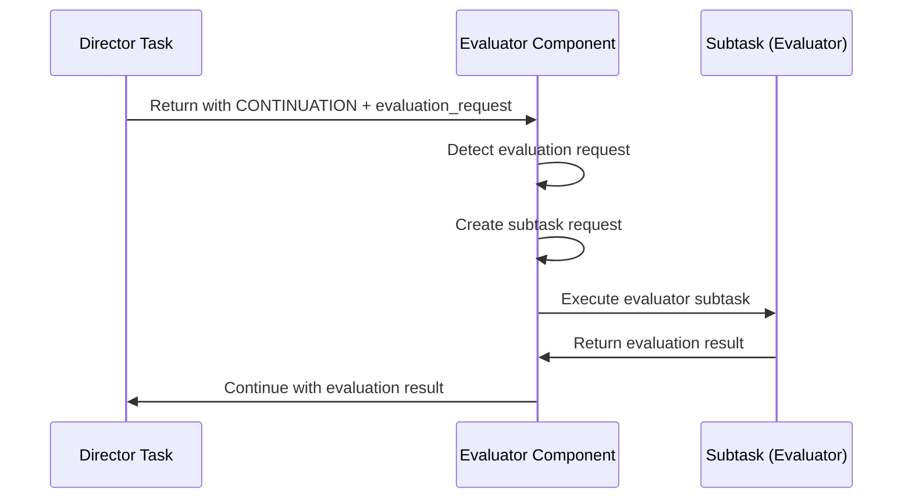
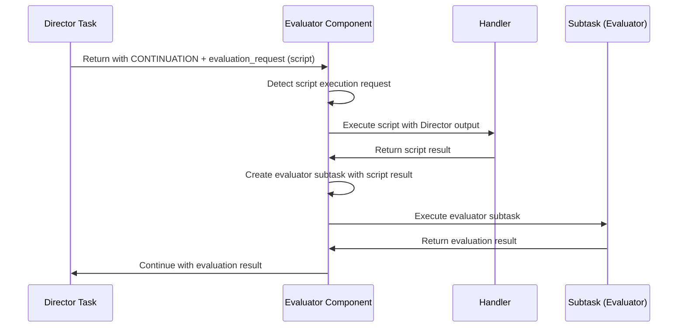

# Director-Evaluator Implementation [Implementation:DynamicDirectorEvaluator:1.0]

This document provides implementation details for the dynamic variant of the Director-Evaluator pattern defined in [Pattern:DirectorEvaluator:1.1].

## Dynamic Director-Evaluator Implementation

```typescript
class Evaluator {
  async handleDirectorContinuation(result: TaskResult, task: Task): Promise<TaskResult> {
    if (result.status !== 'CONTINUATION' || !result.notes?.evaluation_request) {
      return result;
    }
    
    const evaluationRequest = result.notes.evaluation_request;
    
    // Find appropriate evaluator template
    const evaluatorTemplate = await this.findEvaluatorTemplate(
      evaluationRequest.type,
      evaluationRequest.criteria
    );
    
    // Prepare evaluator inputs
    const evaluatorInputs = {
      target_content: result.content,
      criteria: evaluationRequest.criteria
    };
    
    // If there's a script to execute, do that first
    if (evaluationRequest.target && evaluationRequest.type === 'bash_script') {
      const scriptResult = await this.executeScript(
        evaluationRequest.target,
        result.content
      );
      
      // Add script results to evaluator inputs
      evaluatorInputs.stdout = scriptResult.stdout;
      evaluatorInputs.stderr = scriptResult.stderr;
      evaluatorInputs.exit_code = scriptResult.exitCode;
    }
    
    // Execute evaluator
    const evaluationResult = await this.executeTask(
      evaluatorTemplate,
      evaluatorInputs
    );
    
    // Resume director with evaluation feedback
    return this.resumeDirector(task, {
      original_output: result.content,
      evaluation: evaluationResult
    });
  }
  
  private async findEvaluatorTemplate(type: string, criteria: string[]): Promise<Task> {
    // Find evaluator template based on type and criteria
    // ...
  }
  
  private async executeScript(scriptPath: string, input: string): Promise<ScriptResult> {
    // Execute script using Handler or script execution service
    // ...
  }
  
  private async resumeDirector(task: Task, inputs: any): Promise<TaskResult> {
    // Resume director with evaluation feedback
    // ...
  }
}
```

For information on the static variant implementation, see [Implementation:StaticDirectorEvaluator:1.0].
# Director-Evaluator Implementation [Implementation:DynamicDirectorEvaluator:1.0]

## Purpose
This document describes how the Evaluator implements the Director-Evaluator pattern, focusing on the dynamic variant that uses the subtask spawning mechanism.

## Related Documents
- [Component:Evaluator:1.0](../README.md)
- [Pattern:DirectorEvaluator:1.1](../../../system/architecture/patterns/director-evaluator.md)
- [Implementation:SubtaskSpawning:1.0](./subtask-spawning.md)

## Dynamic Director-Evaluator Implementation

The Evaluator implements the dynamic Director-Evaluator pattern through these key components:

1. **Continuation Detection**:
   ```typescript
   function detectEvaluationRequest(result: TaskResult): boolean {
     return (
       result.status === 'CONTINUATION' &&
       result.notes &&
       result.notes.evaluation_request &&
       typeof result.notes.evaluation_request === 'object' &&
       result.notes.evaluation_request.type &&
       result.notes.evaluation_request.criteria
     );
   }
   ```

2. **Evaluation Request Processing**:
   ```typescript
   async function processEvaluationRequest(
     request: EvaluationRequest, 
     directorResult: TaskResult, 
     env: Environment
   ): Promise<TaskResult> {
     // Validate the evaluation request
     validateEvaluationRequest(request);
     
     // Create subtask request for the evaluator
     const subtaskRequest = createEvaluatorSubtaskRequest(request, directorResult);
     
     // Process the subtask request
     return await processSubtaskRequest(subtaskRequest, env);
   }
   ```

3. **Template Selection**:
   ```typescript
   function createEvaluatorSubtaskRequest(
     request: EvaluationRequest, 
     directorResult: TaskResult
   ): SubtaskRequest {
     return {
       type: 'atomic',
       description: `Evaluate output based on criteria: ${request.criteria}`,
       inputs: {
         output: directorResult.content,
         criteria: request.criteria,
         target: request.target || ''
       },
       template_hints: [
         `evaluate_${request.type}`,
         'evaluate_output',
         'general_evaluator'
       ],
       context_management: {
         inherit_context: 'subset',
         accumulate_data: false,
         fresh_context: 'disabled'
       }
     };
   }
   ```

## Execution Flow Between Director and Evaluator

The execution flow follows these steps:

1. **Director Execution**:
   - The Director task executes and produces an initial output
   - If evaluation is needed, it returns with `status: 'CONTINUATION'`
   - The `evaluation_request` is included in the `notes` field

2. **Continuation Detection**:
   - The Evaluator detects the `CONTINUATION` status
   - It validates the `evaluation_request` structure
   - If valid, it proceeds with evaluation

3. **Evaluator Execution**:
   - A subtask request is created for the Evaluator
   - Template selection uses the `evaluation_request.type` and `criteria`
   - The Evaluator subtask executes with the Director's output

4. **Result Processing**:
   - The Evaluator's result is returned to the parent task
   - The parent task can continue execution with the evaluation result
   - This may lead to further iterations if needed



## Context Management Between Iterations

The Evaluator manages context between Director-Evaluator iterations:

1. **Director Context**:
   - The Director typically uses `inherit_context: 'none'` to start fresh
   - It may use `fresh_context: 'enabled'` to get relevant context
   - This ensures the Director has a clean slate for each iteration

2. **Evaluator Context**:
   - The Evaluator uses `inherit_context: 'subset'` to get relevant context
   - It needs access to the original task description and requirements
   - It also receives the Director's output as an explicit input

3. **Iteration Context**:
   - Each iteration's results are preserved in the parent task's environment
   - The current iteration count is tracked and passed to the Director
   - Previous evaluation feedback is passed to the Director

```typescript
function prepareDirectorEnvironment(
  parentEnv: Environment, 
  iteration: number, 
  previousEvaluation: any
): Environment {
  const env = new Environment(parentEnv);
  env.define('current_iteration', iteration);
  env.define('evaluation_feedback', previousEvaluation);
  return env;
}
```

## Script Execution Integration

The Evaluator integrates script execution with the Director-Evaluator pattern:

1. **Script Execution Detection**:
   ```typescript
   function hasScriptExecution(request: EvaluationRequest): boolean {
     return Boolean(
       request.type === 'script' && 
       request.target && 
       typeof request.target === 'string'
     );
   }
   ```

2. **Script Execution Processing**:
   ```typescript
   async function executeScript(
     command: string, 
     input: string, 
     timeout: number = 300
   ): Promise<ScriptResult> {
     try {
       // Delegate to Handler for script execution
       return await handler.executeScript(command, input, timeout);
     } catch (error) {
       throw new ScriptExecutionError(
         `Script execution failed: ${error.message}`,
         { command, error }
       );
     }
   }
   ```

3. **Result Integration**:
   ```typescript
   function integrateScriptResult(
     evaluatorRequest: SubtaskRequest, 
     scriptResult: ScriptResult
   ): SubtaskRequest {
     // Add script result to evaluator inputs
     return {
       ...evaluatorRequest,
       inputs: {
         ...evaluatorRequest.inputs,
         script_result: scriptResult
       }
     };
   }
   ```

When script execution is part of the evaluation process:
1. The script is executed with the Director's output as input
2. The script result (stdout, stderr, exit code) is captured
3. The result is passed to the Evaluator as an additional input
4. The Evaluator considers both the original output and script results
5. This enables automated testing and validation



## Static Director-Evaluator Loop Support

While the static variant is primarily implemented in the Task System, the Evaluator supports it through:

1. **Loop State Management**:
   - Tracking iteration count
   - Preserving previous outputs and evaluations
   - Checking termination conditions

2. **Component Execution**:
   - Executing the Director component with appropriate inputs
   - Executing the Evaluator component with the Director's output
   - Executing script execution if configured

3. **Termination Handling**:
   - Evaluating termination conditions
   - Determining when to stop the loop
   - Returning the final result

The Evaluator's role is to execute each component of the loop according to the task configuration, while the Task System defines the overall structure and flow.
