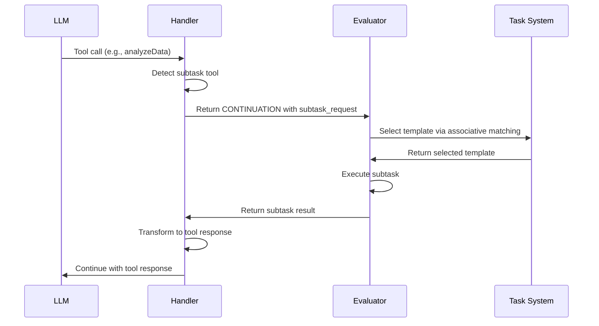

# Subtask Spawning Implementation [Implementation:SubtaskSpawning:1.0]

## Purpose
This document describes how the Evaluator implements the subtask spawning mechanism, including request processing, context management, depth control, and tool integration.

## Related Documents
- [Component:Evaluator:1.0](../README.md)
- [Pattern:SubtaskSpawning:1.0](../../../system/architecture/patterns/subtask-spawning.md)
- [Pattern:ToolInterface:1.0](../../../system/architecture/patterns/tool-interface.md)
- [ADR 11: Subtask Spawning Mechanism](../../../system/architecture/decisions/completed/011-subtask-spawning.md)

## SubtaskRequest Processing

The Evaluator processes subtask requests through these key components:

1. **Request Detection**:
   ```typescript
   function detectSubtaskRequest(result: TaskResult): boolean {
     return (
       result.status === 'CONTINUATION' &&
       result.notes &&
       result.notes.subtask_request &&
       typeof result.notes.subtask_request === 'object' &&
       result.notes.subtask_request.type &&
       result.notes.subtask_request.description
     );
   }
   ```

2. **Request Validation**:
   ```typescript
   function validateSubtaskRequest(request: SubtaskRequest): void {
     // Check required fields
     if (!request.type) {
       throw new SubtaskValidationError('Missing required field: type');
     }
     if (!request.description) {
       throw new SubtaskValidationError('Missing required field: description');
     }
     if (!request.inputs || typeof request.inputs !== 'object') {
       throw new SubtaskValidationError('Missing or invalid inputs field');
     }
     
     // Validate context management if present
     if (request.context_management) {
       validateContextManagement(request.context_management);
     }
   }
   ```

3. **Request Processing**:
   ```typescript
   async function processSubtaskRequest(
     request: SubtaskRequest, 
     parentEnv: Environment, 
     depth: number = 0
   ): Promise<TaskResult> {
     // Validate the request
     validateSubtaskRequest(request);
     
     // Check depth limit
     const maxDepth = request.max_depth || DEFAULT_MAX_DEPTH;
     if (depth >= maxDepth) {
       throw new SubtaskDepthError(
         `Maximum subtask nesting depth (${maxDepth}) exceeded`,
         { currentDepth: depth, maxDepth }
       );
     }
     
     // Check for cycles
     if (detectCycle(request, parentEnv)) {
       throw new SubtaskCycleError(
         'Cycle detected in subtask spawning',
         { request }
       );
     }
     
     // Prepare context
     const context = await prepareSubtaskContext(request, parentEnv);
     
     // Create subtask environment
     const subtaskEnv = createSubtaskEnvironment(parentEnv, context, request.inputs);
     
     // Select template
     const template = await selectSubtaskTemplate(request);
     
     // Execute subtask
     try {
       return await executeSubtask(template, subtaskEnv, depth + 1);
     } catch (error) {
       // Wrap error with subtask context
       throw wrapSubtaskError(error, request, depth);
     }
   }
   ```

## Context Management for Subtasks

The Evaluator implements context management for subtasks:

1. **Default Settings**:
   ```typescript
   const DEFAULT_SUBTASK_CONTEXT_CONFIG = {
     inheritContext: 'subset',
     accumulateData: false,
     accumulationFormat: 'notes_only',
     freshContext: 'enabled'
   };
   ```

2. **Context Preparation**:
   ```typescript
   async function prepareSubtaskContext(
     request: SubtaskRequest, 
     parentEnv: Environment
   ): Promise<any> {
     // Start with default config
     const config = { ...DEFAULT_SUBTASK_CONTEXT_CONFIG };
     
     // Override with explicit configuration if present
     if (request.context_management) {
       if (request.context_management.inherit_context) {
         config.inheritContext = request.context_management.inherit_context;
       }
       if (request.context_management.accumulate_data !== undefined) {
         config.accumulateData = request.context_management.accumulate_data;
       }
       if (request.context_management.accumulation_format) {
         config.accumulationFormat = request.context_management.accumulation_format;
       }
       if (request.context_management.fresh_context) {
         config.freshContext = request.context_management.fresh_context;
       }
     }
     
     // Prepare context based on configuration
     let context = null;
     
     // Handle inheritance
     if (config.inheritContext === 'full') {
       context = parentEnv.getContext();
     } else if (config.inheritContext === 'subset') {
       // Handle explicit file paths if provided
       if (request.file_paths && request.file_paths.length > 0) {
         context = await loadSpecifiedFiles(request.file_paths);
       } else {
         // Get relevant subset based on description
         context = await getRelevantSubset(parentEnv.getContext(), request);
       }
     }
     
     // Handle fresh context generation
     if (config.freshContext === 'enabled') {
       const freshContext = await generateFreshContext(request);
       
       // If we already have context from inheritance, merge them
       if (context) {
         context = mergeContexts(context, freshContext);
       } else {
         context = freshContext;
       }
     }
     
     return context;
   }
   ```

3. **Environment Creation**:
   ```typescript
   function createSubtaskEnvironment(
     parentEnv: Environment, 
     context: any, 
     inputs: Record<string, any>
   ): Environment {
     // Create new environment with context
     const env = new Environment(parentEnv, context);
     
     // Add inputs as bindings
     for (const [key, value] of Object.entries(inputs)) {
       env.define(key, value);
     }
     
     return env;
   }
   ```

## Depth Control Implementation

The Evaluator implements depth control to prevent infinite recursion:

1. **Depth Tracking**:
   ```typescript
   function trackDepth(parentEnv: Environment, depth: number): void {
     // Store current depth in environment
     parentEnv.define('__subtask_depth', depth);
     
     // Store subtask path for cycle detection
     const currentPath = parentEnv.lookup('__subtask_path') || [];
     parentEnv.define('__subtask_path', currentPath);
   }
   ```

2. **Cycle Detection**:
   ```typescript
   function detectCycle(request: SubtaskRequest, parentEnv: Environment): boolean {
     const currentPath = parentEnv.lookup('__subtask_path') || [];
     
     // Create a signature for this subtask
     const signature = createSubtaskSignature(request);
     
     // Check if this signature exists in the path
     return currentPath.includes(signature);
   }
   
   function createSubtaskSignature(request: SubtaskRequest): string {
     // Create a unique signature based on type, description, and template hints
     return `${request.type}:${request.description}:${(request.template_hints || []).join(',')}`;
   }
   ```

3. **Depth Limit Enforcement**:
   ```typescript
   function enforceDepthLimit(depth: number, maxDepth: number): void {
     if (depth >= maxDepth) {
       throw new SubtaskDepthError(
         `Maximum subtask nesting depth (${maxDepth}) exceeded`,
         { currentDepth: depth, maxDepth }
       );
     }
   }
   ```

## Tool Interface Integration

The Evaluator integrates the subtask spawning mechanism with the unified tool interface:

1. **Tool Call Detection**:
   ```typescript
   function isSubtaskToolCall(toolCall: any): boolean {
     // Check if this tool call should be implemented as a subtask
     return SUBTASK_TOOL_REGISTRY.has(toolCall.name);
   }
   ```

2. **Tool Call Transformation**:
   ```typescript
   function transformToolCallToSubtaskRequest(
     toolCall: any, 
     toolRegistry: Map<string, SubtaskToolDefinition>
   ): SubtaskRequest {
     const toolDef = toolRegistry.get(toolCall.name);
     if (!toolDef) {
       throw new ToolNotFoundError(`Tool not found: ${toolCall.name}`);
     }
     
     return {
       type: 'atomic',
       description: toolDef.description,
       inputs: toolCall.arguments,
       template_hints: toolDef.templateHints,
       context_management: toolDef.contextManagement,
       subtype: 'subtask'
     };
   }
   ```

3. **Result Transformation**:
   ```typescript
   function transformSubtaskResultToToolResponse(
     toolCall: any, 
     result: TaskResult
   ): any {
     // Transform the subtask result into a tool response
     return {
       tool_call_id: toolCall.id,
       name: toolCall.name,
       response: {
         content: result.content,
         status: result.status,
         metadata: result.notes
       }
     };
   }
   ```

The integration follows these steps:
1. The Handler detects a tool call that requires complex processing
2. It returns a `CONTINUATION` status with a subtask request
3. The Evaluator processes the subtask request
4. The result is transformed into a tool response
5. The Handler adds the response to the conversation history
6. The parent task continues execution with the tool result



## Error Handling

The Evaluator implements robust error handling for subtasks:

1. **Error Wrapping**:
   ```typescript
   function wrapSubtaskError(
     error: any, 
     request: SubtaskRequest, 
     depth: number
   ): TaskError {
     return {
       type: 'TASK_FAILURE',
       reason: 'subtask_failure',
       message: error.message || 'Subtask execution failed',
       details: {
         subtaskRequest: {
           type: request.type,
           description: request.description,
           inputs: request.inputs
         },
         subtaskError: error,
         nestingDepth: depth,
         partialOutput: error.partialOutput || null
       }
     };
   }
   ```

2. **Partial Result Preservation**:
   ```typescript
   function preservePartialResults(result: TaskResult, error: any): void {
     if (result && result.content) {
       error.partialOutput = result.content;
     }
     if (result && result.notes) {
       error.partialNotes = result.notes;
     }
   }
   ```

3. **Error Propagation**:
   ```typescript
   function propagateSubtaskError(error: any, parentEnv: Environment): TaskResult {
     return {
       status: 'FAILED',
       content: '',
       notes: {
         error: error,
         partialOutput: error.partialOutput || null
       }
     };
   }
   ```

This error handling ensures that:
1. Subtask failures are properly wrapped with context
2. Partial results are preserved when available
3. The parent task receives detailed error information
4. Recovery strategies can be implemented at the parent level
